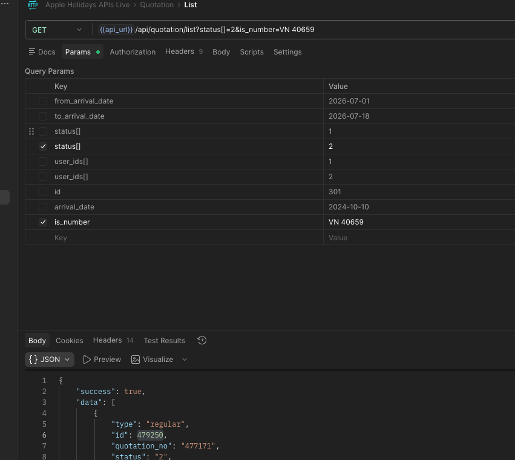
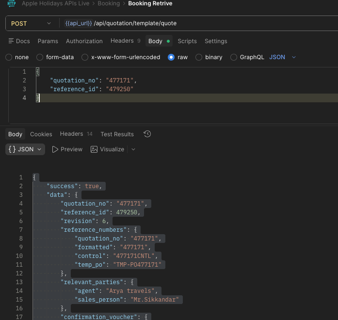

Create new Function ---> cretivly and more accurate  more advance and more modern 

I need to add New Option In new booking creation 
Using AS API 
 
 can create NEW booking 
 USING IS NUMBER SERCH 
 {{api_url}}/api/quotation/list?status[]=2&is_number=VN 40659
Status 2 is confirmed Booking only get COnfirmed Bookings 



Bookking Details can retrie from this 
{{api_url}}/api/quotation/template/quote

{
	"quotation_no": "477171",      # List   "quotation_no": "477171"
	"reference_id": "479250"       # LIST     "id": 479250
}




WHen Using this API  And create Booking only Need  to ALl the detailed That api retriews 
Save in the databse 

and Need to Show that data in the Booking Details page creatively 

Dont Harm to now working system and Now working LIVE db (Dont loss data now having in live db ensure live data is safe )

I neeed to Create new Page for that 

And Create anothe tab for in side same page 

Auto CReate today created all bookings I need to Auto create 24 continulsy daily End of the day Need to create that booking in to system and Notify yester day created booking count ,  within that day came all booking need to create booking That servins can Active or can Inactive (save this active inactive value in DB )


Try to find all the data find tru APIs 
Any Details need for perticular booking U can use all apis inside in here to create booking ( AppleSystem_API_Intigrate/Apple Holidays APIs Live.postman_collection.json )


| New Booking API    | Apple System API                                                                                    |
| ------------------ | --------------------------------------------------------------------------------------------------- |
| `bookingRef`       | `pnl.quotation_info.is_number`                                                                      |
| `agentBookingId`   | *(Not available - leave empty or manual)*                                                           |
| `cntlNumber`       | `quotation_no`                                                                                      |
| `operationCountry` | Detect from `is_number` prefix (`IS` → SRILANKA, `VN` → VIETNAM, `SG` → SINGAPORE, `MY` → MALAYSIA) |
| `agent`            | `pnl.quotation_info.agent_name`                                                                     |
| `fileHandler`      | `confirmation_voucher.file_handler_name`                                                            |
| `arrivalDate`      | itinerary Date 1`                                                                                   |
| `departureDate`    | itinerary last date                                                                                 |
| `paxAdults`        | `pnl.quotation_info.pax.adult`                                                                      |
| `paxChildren`      | `pnl.quotation_info.pax.child`                                                                      |
| `quotedTotal`      | quotedTotal                                               
| `currency`         | `pnl.quotation_info.currency`                                                                       |

### Notes

| New Booking API      | Apple System API                                |
| -------------------- | ----------------------------------------------- |
| `terms`              | `terms_and_conditions.join('\n')`               |
| `packageIncludes`    | `package_includes.join('\n')`                   |
| `packageExcludes`    | `package_excludes.join('\n')`                   |
| `valueAddedServices` | `value_added_services.join('\n')`               |
| `importantNotes`     |                           |
| `policyNotes`        |  |
| `clientRequest`      |                             |

### Agent Contact

| New Booking API | Apple System API  |
| --------------- | ----------------- |
| `agentEmail`    | PNL object -->quotation_info ---> Agent  |
| `agentPhone`    |  
| `agentWhatsapp` |  |

### guest Contact

| New Booking API   | Apple System API                   |
| ----------------- | ---------------------------------- |
| `contactEmail`    | `confirmation_voucher.guest_email` |
| `contactPhone`    |                 |
| `contactWhatsapp` |                 |

### Passengers

```ts
passengers = [
  {
    name: confirmation_voucher.guest_name,
    type: "ADULT",
    age: null,
    isLead: true,
    passport: "",
    nationality: ""
  }
]
```

### Accommodations

```ts
accommodations = accommodation.map(h => ({
    city: h.city,
    hotel: h.name,
    checkIn: h.check_in,
    checkOut: h.check_out,
    nights: h.nights,
    roomType: h.room_type || h.cabin_type,
    mealType: h.meal_plan,
    address: ""
}))
```

### Itinerary

```ts
itineraryItems = itinerary.map(i => ({
    dayNo: i.day,
    date: i.date,
    title: i.route,
    description: i.description
}))
```

### Emergency Contacts

```ts
emergencyContacts = [
  {
      name: "Emergency",
      phone: confirmation_voucher.emergency_contact,
      role: "24/7 Emergency"
  }
]
```

### Flights

The Apple response you shared **does not contain flight information**, so:

```ts
flights: []
```

or populate it from another API if available.

---


input OPS System New booking - System input json 

{
  "bookingRef": "IS123456",           ------> is_number (AS API - PNL Object ) 
  "agentBookingId": "AGT-0099",       ------>
  "cntlNumber": "CNTL-771",           ------> quotation_no (AS API)
  "operationCountry": "SRILANKA",     ------> Country Auto Detect (is_number is --> IS -> Sri lanka ,VN --> Vietnam , SG--> Singapoor , MY--> Malaysia )

  "agent": "GlobalTravel",             ------>  agent_name (AS API - PNL Object ) 
  "fileHandler": "Sasindu",           -------> file_handler_name 

  "arrivalDate": "2025-12-30",       ------->  itinerary Date 1` 
  "departureDate": "2026-01-05",     ------->  itinerary Date Last date ` 
  "paxAdults": 2,                    -------> 
  "paxChildren": 1,                 --------> 

  "quotedTotal": 1850,              --------> 
  "currency": "USD",                --------> 

  "terms": "",
  "exclusions": "",
  "policyNotes": "",
  "amendmentNote": "",
  "valueAddedServices": "",
  "packageIncludes": "",
  "packageExcludes": "",
  "importantNotes": "",
  "tips": "",
  "otherNote": "",
  "clientRequest": "",

  "agentEmail": "",
  "agentPhone": "",
  "agentWhatsapp": "",

  "contactEmail": "",
  "contactPhone": "",
  "contactWhatsapp": "",

  "passengers": [
    {
      "name": "John Smith",
      "type": "ADULT",
      "age": 34,
      "isLead": true,
      "passport": "N1234567",
      "nationality": "British"
    }
  ],

  "flights": [
    {
      "flightNo": "UL504",
      "date": "2025-12-30",
      "fromApt": "LHR",
      "depTime": "21:15",
      "toApt": "CMB",
      "arrTime": "11:45",
      "airline": "SriLankan Airlines"
    }
  ],

  "accommodations": [
    {
      "city": "Kandy",
      "hotel": "Earl's Regency",
      "checkIn": "2025-12-31",
      "checkOut": "2026-01-02",
      "nights": 2,
      "roomType": "Deluxe Double",
      "mealType": "Half Board",
      "address": ""
    }
  ],

  "itineraryItems": [
    {
      "dayNo": 1,
      "date": "2025-12-30",
      "title": "Airport pickup and transfer to Kandy",
      "description": "Private vehicle and driver"
    }
  ],

  "emergencyContacts": [
    {
      "name": "Local Ops Desk",
      "phone": "+94770000000",
      "role": "24/7 Emergency"
    }
  ]
}


-------------------------------------------------------------------------------------------------------------------------------

Apple System booking Retrive 

{
    "success": true,
    "data": {
        "quotation_no": "477171",
        "reference_id": 479250,
        "revision": 6,
        "reference_numbers": {
            "quotation_no": "477171",
            "formatted": "477171",
            "control": "477171CNTL",
            "temp_po": "TMP-PO477171"
        },
        "relevant_parties": {
            "agent": "Arya travels",
            "sales_person": "Mr.Sikkandar"
        },
        "confirmation_voucher": {
            "guest_name": "KRISHAN KUMAR SINGH",
            "guest_email": "",
            "guest_id": "",
            "emergency_contact": "Customer Support: Helen (+84 94 959 15 36)\nSenthoor Pandian (+91 95852 22335)\nTina (+84 94 516 95 95)",
            "file_handler_name": "M.Suvarna Priya"
        },
        "accommodation": [
            {
                "city": "Hanoi",
                "check_in": "2026-09-26",
                "check_out": "2026-09-29",
                "nights": 3,
                "type": "hotel",
                "name": "Lester Hanoi Hotel",
                "class": "4 Star",
                "room_type": "DBL(3)/ TPL(1)",
                "room_category": "Superior",
                "meal_plan": "BB"
            },
            {
                "city": "Da Nang( City Center)",
                "check_in": "2026-09-29",
                "check_out": "2026-10-03",
                "nights": 4,
                "type": "hotel",
                "name": "Hadana Boutique Hotel",
                "class": "4 Star",
                "room_type": "DBL(3)/ TPL(1)",
                "room_category": "Deluxe",
                "meal_plan": "BB"
            },
            {
                "city": "Halong Bay",
                "check_in": "2026-10-01",
                "check_out": "2026-10-02",
                "nights": 1,
                "type": "cruise",
                "name": "Hera Grand Luxury Cruise",
                "package": "2 Days 1 NIght",
                "cabin_type": "Premium balcony cabin",
                "meal_plan": "FB"
            }
        ],
        "value_added_services": [],
        "package_includes": [
            "Pick up from Noi Bai International Airport",
            "Drop off to Noi Bai International Airport",
            "Pick up from Da Nang International Airport",
            "Drop off to Da Nang International Airport",
            "Accommodation on single/double or triple sharing basis as per the booking",
            "PVT - Hanoi half day city tour",
            "PVT - Ninh binh tour(Hoa Lu – Tam Coc & Mua caves)",
            "PVT - Make my day 3 (Lunch+ Marble Mountain + Bask",
            "PVT - Bana hills tour + cable car + local lunch",
            "PVT - Danang half day city tour",
            "Dinner",
            "Additional",
            "Noi Bai International Airport To Hanoi Transfers on Private basis in A/C",
            "Hanoi To Halong Bay Transfers on Private basis in A/C",
            "Halong Bay To Noi Bai International Airport Transfers on SIC basis in A/C",
            "Da Nang International Airport To Da Nang( City Center) Transfers on Private basis in A/C",
            "Da Nang( City Center) To Da Nang International Airport Transfers on Private basis in A/C",
            "Breakfast at Lester Hanoi Hotel",
            "Breakfast at Hadana Boutique Hotel",
            "Breakfast, Lunch & Dinner at Hera Grand Luxury Cruise"
        ],
        "package_excludes": [
            "Airfare",
            "Any compulsory room supplement during the tour.",
            "Video and Camera permits at sights.",
            "Meals outside of the stated meal plan.",
            "Use of vehicle other than the specified itinerary.",
            "Expenses of personal nature.",
            "Any other services not specified above.",
            "GST",
            "Late check-out and Early check-in.",
            "Visa",
            "Guide tipping not included"
        ],
        "terms_and_conditions": [
            "Once the booking is reconfirmed 100% cancellation will be charged if cancelled less than 21 days prior to arrival.",
            "If booking is done less than 21 days from arrival or less, immediate reconfirmation will be required to secure the booking. Booking cannot be guaranteed until it is reconfirmed. Please note that if the booking is in the cancellation period(within 21 days from arrival) after confirmation if there is any cancellations the penalties will be applied.",
            "Rates are based on for 2 pax only.",
            "Maximum no of persons accommodated in a room would be 3 adults or 2 adults and 2 children",
            "Children below 2 years will be free of charge (Only one infant per couple)",
            "If flight details are not received within 48 hrs from arrival, airport transfers cannot be guaranteed.",
            "Based on the flight timing, the final program may subject to change  / kindly consider confirmation voucher as the final",
            "IMPORTANT NOTE: Unforeseen escalation in fuel prices, new taxes/levies on hotels and transportation services or any hikes in entrance fees. Any \nlarge tax hikes and new levies shall be payable extra and shall be billed accordingly with reasonable prior notice.",
            "IMPORTANT NOTE: The invoice will be calculated based based on the current XE exchange rate plus +1"
        ],
        "itinerary": [
            {
                "day": 1,
                "date": "2026-09-26",
                "date_formatted": "Sep 26, 2026",
                "route": "Pick Up from Noi Bai International Airport -> Hanoi",
                "description": "Hanoi, the capital of Vietnam, is known for its centuries-old architecture and a rich culture with Southeast Asian, Chinese and French influences. At its heart is the chaotic Old Quarter, where the narrow streets are roughly arranged by trade. There are many little temples, including Bach Ma, honoring a legendary horse, plus Đồng Xuân Market, selling household goods and street food.",
                "activities": []
            },
            {
                "day": 2,
                "date": "2026-09-27",
                "date_formatted": "Sep 27, 2026",
                "route": "Hanoi",
                "description": "Day at leisure at the Hotel!",
                "activities": [
                    {
                        "type": "sightseeing",
                        "name": "PVT - Ninh binh tour(Hoa Lu – Tam Coc & Mua caves)",
                        "description": null
                    }
                ]
            },
            {
                "day": 3,
                "date": "2026-09-28",
                "date_formatted": "Sep 28, 2026",
                "route": "Hanoi",
                "description": "Day at leisure at the Hotel!",
                "activities": [
                    {
                        "type": "sightseeing",
                        "name": "PVT - Hanoi half day city tour",
                        "description": null
                    }
                ]
            },
            {
                "day": 4,
                "date": "2026-09-29",
                "date_formatted": "Sep 29, 2026",
                "route": "Hanoi -> Halong Bay",
                "description": "Hạ Long Bay, in northeast Vietnam, is known for its emerald waters and thousands of towering limestone islands topped by rainforests. Junk boat tours and sea kayak expeditions take visitors past islands named for their shapes, including Stone Dog and Teapot islets. The region is popular for scuba diving, rock climbing and hiking, particularly in mountainous Cát Bà National Park.",
                "activities": []
            },
            {
                "day": 5,
                "date": "2026-09-30",
                "date_formatted": "Sep 30, 2026",
                "route": "Halong Bay -> Drop Off To -> Noi Bai International Airport -> Da Nang International Airport -> Da Nang( City Center)",
                "description": "Da Nang is a coastal city in central Vietnam known for its sandy beaches and history as a French colonial port. It's a popular base for visiting the inland Bà Nà hills to the west of the city. Here the hillside Hải Vân Pass has views of Da Nang Bay and the Marble Mountains. These 5 limestone outcrops are topped with pagodas and hide caves containing Buddhist shrines.",
                "activities": [
                    {
                        "type": "sightseeing",
                        "name": "PVT - Make my day 3 (Lunch+ Marble Mountain + Bask",
                        "description": null
                    }
                ]
            },
            {
                "day": 6,
                "date": "2026-10-01",
                "date_formatted": "Oct 1, 2026",
                "route": "Da Nang( City Center)",
                "description": "Day at leisure at the Hotel!",
                "activities": [
                    {
                        "type": "sightseeing",
                        "name": "PVT - Bana hills tour + cable car + local lunch",
                        "description": null
                    }
                ]
            },
            {
                "day": 7,
                "date": "2026-10-02",
                "date_formatted": "Oct 2, 2026",
                "route": "Da Nang( City Center)",
                "description": "Day at leisure at the Hotel!",
                "activities": []
            },
            {
                "day": 8,
                "date": "2026-10-03",
                "date_formatted": "Oct 3, 2026",
                "route": "Da Nang( City Center)",
                "description": "Day at leisure at the Hotel!",
                "activities": []
            },
            {
                "day": 9,
                "date": "2026-10-04",
                "date_formatted": "Oct 4, 2026",
                "route": "Da Nang( City Center) -> Drop Off to Da Nang International Airport",
                "description": "Transfer to airport for home bound flight",
                "activities": []
            }
        ],
        "pnl": {
            "quotation_info": {
                "quotation_no": "477171",
                "reference_id": 479250,
                "is_number": "VN 40659",
                "agent_name": "Arya travels",
                "pax": {
                    "adult": "9",
                    "cwb": "0",
                    "cnb": "0",
                    "child": 0
                },
                "total_pax": 9,
                "nights": 7,
                "days": 8,
                "currency": "USD",
                "exchange_rate": "1.00",
                "is_local": false
            },
            "hotels_cruises": [
                {
                    "type": "hotel",
                    "name": "Lester Hanoi Hotel",
                    "sgl": {
                        "rates": [],
                        "rate_text": "0",
                        "rooms": 0
                    },
                    "dbl": {
                        "rates": [
                            "39",
                            "39",
                            "39"
                        ],
                        "rate_text": "39 / 39 / 39 /",
                        "rooms": "3"
                    },
                    "tpl": {
                        "rates": [
                            "62.33",
                            "62.33",
                            "62.33"
                        ],
                        "rate_text": "62.33 / 62.33 / 62.33 /",
                        "rooms": "1"
                    },
                    "cwb": {
                        "rate": "19.61",
                        "count": "0"
                    },
                    "cnb": {
                        "rate": "9.8",
                        "count": "0"
                    },
                    "nights": 3,
                    "total": 537.99
                },
                {
                    "type": "hotel",
                    "name": "Hadana Boutique Hotel",
                    "sgl": {
                        "rates": [],
                        "rate_text": "0",
                        "rooms": 0
                    },
                    "dbl": {
                        "rates": [
                            "28",
                            "28",
                            "28",
                            "28"
                        ],
                        "rate_text": "28 / 28 / 28 / 28 /",
                        "rooms": "3"
                    },
                    "tpl": {
                        "rates": [
                            "55.25",
                            "55.25",
                            "55.25",
                            "55.25"
                        ],
                        "rate_text": "55.25 / 55.25 / 55.25 / 55.25 /",
                        "rooms": "1"
                    },
                    "cwb": {
                        "rate": "9.62",
                        "count": "0"
                    },
                    "cnb": {
                        "rate": "5",
                        "count": "0"
                    },
                    "nights": 4,
                    "total": 557
                },
                {
                    "type": "cruise",
                    "name": "Hera Grand Luxury Cruise",
                    "sgl": {
                        "rates": [],
                        "rate_text": "0",
                        "rooms": 0
                    },
                    "dbl": {
                        "rates": [
                            "223"
                        ],
                        "rate_text": "223 /",
                        "rooms": "3"
                    },
                    "tpl": {
                        "rates": [
                            "427"
                        ],
                        "rate_text": "427 /",
                        "rooms": "1"
                    },
                    "cwb": {
                        "rate": 0,
                        "count": "0"
                    },
                    "cnb": {
                        "rate": 0,
                        "count": "0"
                    },
                    "nights": 1,
                    "total": 1096
                }
            ],
            "accommodation": {
                "total": 56,
                "days": 7
            },
            "budget": {
                "hotel": {
                    "0": {
                        "hotel_settings": {
                            "hotel": "4562",
                            "place": "307",
                            "check_in": {
                                "year": "2026",
                                "month": "9",
                                "day": "26"
                            },
                            "check_out": {
                                "year": "2026",
                                "month": "9",
                                "day": "29"
                            },
                            "night": 3,
                            "provider": "local",
                            "room_category": "14",
                            "meal_type": "1",
                            "room_type": {
                                "2": "3",
                                "3": "1"
                            },
                            "extrabed": "0",
                            "driver_accommodation": "1"
                        },
                        "rate": {
                            "adult": [
                                {
                                    "2": {
                                        "ID": "1324778",
                                        "quotation_hotel": "1273988",
                                        "rate_id": "0",
                                        "hotel_id": "4562",
                                        "year": "2026",
                                        "month": "9",
                                        "day": "26",
                                        "meal": "1",
                                        "room_type": "2",
                                        "room_category": "14",
                                        "rate": "39",
                                        "modified_rate": "39",
                                        "reason": "0",
                                        "is_modified": "1",
                                        "bookday_index": "0",
                                        "created_by": null,
                                        "updated_by": null,
                                        "created_at": "2026-07-21 10:13:13",
                                        "updated_at": "2026-07-21 10:13:13",
                                        "deleted_at": null,
                                        "upload_id": null,
                                        "hotel": "4562"
                                    },
                                    "3": {
                                        "ID": "1324779",
                                        "quotation_hotel": "1273988",
                                        "rate_id": "0",
                                        "hotel_id": "4562",
                                        "year": "2026",
                                        "month": "9",
                                        "day": "26",
                                        "meal": "1",
                                        "room_type": "3",
                                        "room_category": "14",
                                        "rate": "62.33",
                                        "modified_rate": "62.33",
                                        "reason": "0",
                                        "is_modified": "1",
                                        "bookday_index": "0",
                                        "created_by": null,
                                        "updated_by": null,
                                        "created_at": "2026-07-21 10:13:13",
                                        "updated_at": "2026-07-21 10:13:13",
                                        "deleted_at": null,
                                        "upload_id": null,
                                        "hotel": "4562"
                                    }
                                },
                                {
                                    "2": {
                                        "ID": "1324780",
                                        "quotation_hotel": "1273988",
                                        "rate_id": "0",
                                        "hotel_id": "4562",
                                        "year": "2026",
                                        "month": "9",
                                        "day": "27",
                                        "meal": "1",
                                        "room_type": "2",
                                        "room_category": "14",
                                        "rate": "39",
                                        "modified_rate": "39",
                                        "reason": "0",
                                        "is_modified": "1",
                                        "bookday_index": "1",
                                        "created_by": null,
                                        "updated_by": null,
                                        "created_at": "2026-07-21 10:13:13",
                                        "updated_at": "2026-07-21 10:13:13",
                                        "deleted_at": null,
                                        "upload_id": null,
                                        "hotel": "4562"
                                    },
                                    "3": {
                                        "ID": "1324781",
                                        "quotation_hotel": "1273988",
                                        "rate_id": "0",
                                        "hotel_id": "4562",
                                        "year": "2026",
                                        "month": "9",
                                        "day": "27",
                                        "meal": "1",
                                        "room_type": "3",
                                        "room_category": "14",
                                        "rate": "62.33",
                                        "modified_rate": "62.33",
                                        "reason": "0",
                                        "is_modified": "1",
                                        "bookday_index": "1",
                                        "created_by": null,
                                        "updated_by": null,
                                        "created_at": "2026-07-21 10:13:13",
                                        "updated_at": "2026-07-21 10:13:13",
                                        "deleted_at": null,
                                        "upload_id": null,
                                        "hotel": "4562"
                                    }
                                },
                                {
                                    "2": {
                                        "ID": "1324782",
                                        "quotation_hotel": "1273988",
                                        "rate_id": "0",
                                        "hotel_id": "4562",
                                        "year": "2026",
                                        "month": "9",
                                        "day": "28",
                                        "meal": "1",
                                        "room_type": "2",
                                        "room_category": "14",
                                        "rate": "39",
                                        "modified_rate": "39",
                                        "reason": "0",
                                        "is_modified": "1",
                                        "bookday_index": "2",
                                        "created_by": null,
                                        "updated_by": null,
                                        "created_at": "2026-07-21 10:13:13",
                                        "updated_at": "2026-07-21 10:13:13",
                                        "deleted_at": null,
                                        "upload_id": null,
                                        "hotel": "4562"
                                    },
                                    "3": {
                                        "ID": "1324783",
                                        "quotation_hotel": "1273988",
                                        "rate_id": "0",
                                        "hotel_id": "4562",
                                        "year": "2026",
                                        "month": "9",
                                        "day": "28",
                                        "meal": "1",
                                        "room_type": "3",
                                        "room_category": "14",
                                        "rate": "62.33",
                                        "modified_rate": "62.33",
                                        "reason": "0",
                                        "is_modified": "1",
                                        "bookday_index": "2",
                                        "created_by": null,
                                        "updated_by": null,
                                        "created_at": "2026-07-21 10:13:13",
                                        "updated_at": "2026-07-21 10:13:13",
                                        "deleted_at": null,
                                        "upload_id": null,
                                        "hotel": "4562"
                                    }
                                }
                            ],
                            "cwb": [
                                {
                                    "ID": "2314390",
                                    "quotation_hotel_rate_id": "1324783",
                                    "year": "2026",
                                    "month": "9",
                                    "day": "26",
                                    "age_from": "2",
                                    "age_to": "12",
                                    "rate": "19.61",
                                    "modified_rate": "19.61",
                                    "reason": "0",
                                    "is_modified": "1",
                                    "created_by": null,
                                    "updated_by": null,
                                    "created_at": "2026-07-21 10:13:13",
                                    "updated_at": "2026-07-21 10:13:13",
                                    "deleted_at": null,
                                    "upload_id": null,
                                    "hotel": "4562"
                                },
                                {
                                    "ID": "2314391",
                                    "quotation_hotel_rate_id": "1324783",
                                    "year": "2026",
                                    "month": "9",
                                    "day": "27",
                                    "age_from": "2",
                                    "age_to": "12",
                                    "rate": "19.61",
                                    "modified_rate": "19.61",
                                    "reason": "0",
                                    "is_modified": "1",
                                    "created_by": null,
                                    "updated_by": null,
                                    "created_at": "2026-07-21 10:13:13",
                                    "updated_at": "2026-07-21 10:13:13",
                                    "deleted_at": null,
                                    "upload_id": null,
                                    "hotel": "4562"
                                },
                                {
                                    "ID": "2314392",
                                    "quotation_hotel_rate_id": "1324783",
                                    "year": "2026",
                                    "month": "9",
                                    "day": "28",
                                    "age_from": "2",
                                    "age_to": "12",
                                    "rate": "19.61",
                                    "modified_rate": "19.61",
                                    "reason": "0",
                                    "is_modified": "1",
                                    "created_by": null,
                                    "updated_by": null,
                                    "created_at": "2026-07-21 10:13:13",
                                    "updated_at": "2026-07-21 10:13:13",
                                    "deleted_at": null,
                                    "upload_id": null,
                                    "hotel": "4562"
                                }
                            ],
                            "cnb": [
                                {
                                    "ID": "2314393",
                                    "quotation_hotel_rate_id": "1324783",
                                    "year": "2026",
                                    "month": "9",
                                    "day": "26",
                                    "age_from": "0",
                                    "age_to": "2",
                                    "rate": "9.8",
                                    "modified_rate": "9.8",
                                    "reason": "",
                                    "is_modified": "1",
                                    "created_by": null,
                                    "updated_by": null,
                                    "created_at": "2026-07-21 10:13:13",
                                    "updated_at": "2026-07-21 10:13:13",
                                    "deleted_at": null,
                                    "upload_id": null,
                                    "hotel": "4562"
                                },
                                {
                                    "ID": "2314394",
                                    "quotation_hotel_rate_id": "1324783",
                                    "year": "2026",
                                    "month": "9",
                                    "day": "27",
                                    "age_from": "0",
                                    "age_to": "2",
                                    "rate": "9.8",
                                    "modified_rate": "9.8",
                                    "reason": "",
                                    "is_modified": "1",
                                    "created_by": null,
                                    "updated_by": null,
                                    "created_at": "2026-07-21 10:13:13",
                                    "updated_at": "2026-07-21 10:13:13",
                                    "deleted_at": null,
                                    "upload_id": null,
                                    "hotel": "4562"
                                },
                                {
                                    "ID": "2314395",
                                    "quotation_hotel_rate_id": "1324783",
                                    "year": "2026",
                                    "month": "9",
                                    "day": "28",
                                    "age_from": "0",
                                    "age_to": "2",
                                    "rate": "9.8",
                                    "modified_rate": "9.8",
                                    "reason": "",
                                    "is_modified": "1",
                                    "created_by": null,
                                    "updated_by": null,
                                    "created_at": "2026-07-21 10:13:13",
                                    "updated_at": "2026-07-21 10:13:13",
                                    "deleted_at": null,
                                    "upload_id": null,
                                    "hotel": "4562"
                                }
                            ],
                            "total": 537.99
                        }
                    },
                    "2": {
                        "hotel_settings": {
                            "hotel": "3828",
                            "place": "310",
                            "check_in": {
                                "year": "2026",
                                "month": "9",
                                "day": "29"
                            },
                            "check_out": {
                                "year": "2026",
                                "month": "10",
                                "day": "3"
                            },
                            "night": 4,
                            "provider": "local",
                            "room_category": "10",
                            "meal_type": "1",
                            "room_type": {
                                "2": "3",
                                "3": "1"
                            },
                            "extrabed": "0",
                            "driver_accommodation": "1"
                        },
                        "rate": {
                            "adult": [
                                {
                                    "2": {
                                        "ID": "1324784",
                                        "quotation_hotel": "1273989",
                                        "rate_id": "0",
                                        "hotel_id": "3828",
                                        "year": "2026",
                                        "month": "9",
                                        "day": "29",
                                        "meal": "1",
                                        "room_type": "2",
                                        "room_category": "10",
                                        "rate": "28",
                                        "modified_rate": "28",
                                        "reason": "0",
                                        "is_modified": "1",
                                        "bookday_index": "0",
                                        "created_by": null,
                                        "updated_by": null,
                                        "created_at": "2026-07-21 10:13:13",
                                        "updated_at": "2026-07-21 10:13:13",
                                        "deleted_at": null,
                                        "upload_id": null,
                                        "hotel": "3828"
                                    },
                                    "3": {
                                        "ID": "1324785",
                                        "quotation_hotel": "1273989",
                                        "rate_id": "0",
                                        "hotel_id": "3828",
                                        "year": "2026",
                                        "month": "9",
                                        "day": "29",
                                        "meal": "1",
                                        "room_type": "3",
                                        "room_category": "10",
                                        "rate": "55.25",
                                        "modified_rate": "55.25",
                                        "reason": "0",
                                        "is_modified": "1",
                                        "bookday_index": "0",
                                        "created_by": null,
                                        "updated_by": null,
                                        "created_at": "2026-07-21 10:13:13",
                                        "updated_at": "2026-07-21 10:13:13",
                                        "deleted_at": null,
                                        "upload_id": null,
                                        "hotel": "3828"
                                    }
                                },
                                {
                                    "2": {
                                        "ID": "1324786",
                                        "quotation_hotel": "1273989",
                                        "rate_id": "0",
                                        "hotel_id": "3828",
                                        "year": "2026",
                                        "month": "9",
                                        "day": "30",
                                        "meal": "1",
                                        "room_type": "2",
                                        "room_category": "10",
                                        "rate": "28",
                                        "modified_rate": "28",
                                        "reason": "0",
                                        "is_modified": "1",
                                        "bookday_index": "1",
                                        "created_by": null,
                                        "updated_by": null,
                                        "created_at": "2026-07-21 10:13:13",
                                        "updated_at": "2026-07-21 10:13:13",
                                        "deleted_at": null,
                                        "upload_id": null,
                                        "hotel": "3828"
                                    },
                                    "3": {
                                        "ID": "1324787",
                                        "quotation_hotel": "1273989",
                                        "rate_id": "0",
                                        "hotel_id": "3828",
                                        "year": "2026",
                                        "month": "9",
                                        "day": "30",
                                        "meal": "1",
                                        "room_type": "3",
                                        "room_category": "10",
                                        "rate": "55.25",
                                        "modified_rate": "55.25",
                                        "reason": "0",
                                        "is_modified": "1",
                                        "bookday_index": "1",
                                        "created_by": null,
                                        "updated_by": null,
                                        "created_at": "2026-07-21 10:13:13",
                                        "updated_at": "2026-07-21 10:13:13",
                                        "deleted_at": null,
                                        "upload_id": null,
                                        "hotel": "3828"
                                    }
                                },
                                {
                                    "2": {
                                        "ID": "1324788",
                                        "quotation_hotel": "1273989",
                                        "rate_id": "0",
                                        "hotel_id": "3828",
                                        "year": "2026",
                                        "month": "10",
                                        "day": "1",
                                        "meal": "1",
                                        "room_type": "2",
                                        "room_category": "10",
                                        "rate": "28",
                                        "modified_rate": "28",
                                        "reason": "0",
                                        "is_modified": "1",
                                        "bookday_index": "2",
                                        "created_by": null,
                                        "updated_by": null,
                                        "created_at": "2026-07-21 10:13:13",
                                        "updated_at": "2026-07-21 10:13:13",
                                        "deleted_at": null,
                                        "upload_id": null,
                                        "hotel": "3828"
                                    },
                                    "3": {
                                        "ID": "1324789",
                                        "quotation_hotel": "1273989",
                                        "rate_id": "0",
                                        "hotel_id": "3828",
                                        "year": "2026",
                                        "month": "10",
                                        "day": "1",
                                        "meal": "1",
                                        "room_type": "3",
                                        "room_category": "10",
                                        "rate": "55.25",
                                        "modified_rate": "55.25",
                                        "reason": "0",
                                        "is_modified": "1",
                                        "bookday_index": "2",
                                        "created_by": null,
                                        "updated_by": null,
                                        "created_at": "2026-07-21 10:13:13",
                                        "updated_at": "2026-07-21 10:13:13",
                                        "deleted_at": null,
                                        "upload_id": null,
                                        "hotel": "3828"
                                    }
                                },
                                {
                                    "2": {
                                        "ID": "1324790",
                                        "quotation_hotel": "1273989",
                                        "rate_id": "0",
                                        "hotel_id": "3828",
                                        "year": "2026",
                                        "month": "10",
                                        "day": "2",
                                        "meal": "1",
                                        "room_type": "2",
                                        "room_category": "10",
                                        "rate": "28",
                                        "modified_rate": "28",
                                        "reason": "0",
                                        "is_modified": "1",
                                        "bookday_index": "3",
                                        "created_by": null,
                                        "updated_by": null,
                                        "created_at": "2026-07-21 10:13:13",
                                        "updated_at": "2026-07-21 10:13:13",
                                        "deleted_at": null,
                                        "upload_id": null,
                                        "hotel": "3828"
                                    },
                                    "3": {
                                        "ID": "1324791",
                                        "quotation_hotel": "1273989",
                                        "rate_id": "0",
                                        "hotel_id": "3828",
                                        "year": "2026",
                                        "month": "10",
                                        "day": "2",
                                        "meal": "1",
                                        "room_type": "3",
                                        "room_category": "10",
                                        "rate": "55.25",
                                        "modified_rate": "55.25",
                                        "reason": "0",
                                        "is_modified": "1",
                                        "bookday_index": "3",
                                        "created_by": null,
                                        "updated_by": null,
                                        "created_at": "2026-07-21 10:13:13",
                                        "updated_at": "2026-07-21 10:13:13",
                                        "deleted_at": null,
                                        "upload_id": null,
                                        "hotel": "3828"
                                    }
                                }
                            ],
                            "cwb": [
                                {
                                    "ID": "2314396",
                                    "quotation_hotel_rate_id": "1324791",
                                    "year": "2026",
                                    "month": "9",
                                    "day": "29",
                                    "age_from": "2",
                                    "age_to": "12",
                                    "rate": "9.62",
                                    "modified_rate": "9.62",
                                    "reason": "0",
                                    "is_modified": "1",
                                    "created_by": null,
                                    "updated_by": null,
                                    "created_at": "2026-07-21 10:13:13",
                                    "updated_at": "2026-07-21 10:13:13",
                                    "deleted_at": null,
                                    "upload_id": null,
                                    "hotel": "3828"
                                },
                                {
                                    "ID": "2314397",
                                    "quotation_hotel_rate_id": "1324791",
                                    "year": "2026",
                                    "month": "9",
                                    "day": "30",
                                    "age_from": "2",
                                    "age_to": "12",
                                    "rate": "9.62",
                                    "modified_rate": "9.62",
                                    "reason": "0",
                                    "is_modified": "1",
                                    "created_by": null,
                                    "updated_by": null,
                                    "created_at": "2026-07-21 10:13:13",
                                    "updated_at": "2026-07-21 10:13:13",
                                    "deleted_at": null,
                                    "upload_id": null,
                                    "hotel": "3828"
                                },
                                {
                                    "ID": "2314398",
                                    "quotation_hotel_rate_id": "1324791",
                                    "year": "2026",
                                    "month": "10",
                                    "day": "1",
                                    "age_from": "2",
                                    "age_to": "12",
                                    "rate": "9.62",
                                    "modified_rate": "9.62",
                                    "reason": "0",
                                    "is_modified": "1",
                                    "created_by": null,
                                    "updated_by": null,
                                    "created_at": "2026-07-21 10:13:13",
                                    "updated_at": "2026-07-21 10:13:13",
                                    "deleted_at": null,
                                    "upload_id": null,
                                    "hotel": "3828"
                                },
                                {
                                    "ID": "2314399",
                                    "quotation_hotel_rate_id": "1324791",
                                    "year": "2026",
                                    "month": "10",
                                    "day": "2",
                                    "age_from": "2",
                                    "age_to": "12",
                                    "rate": "9.62",
                                    "modified_rate": "9.62",
                                    "reason": "0",
                                    "is_modified": "1",
                                    "created_by": null,
                                    "updated_by": null,
                                    "created_at": "2026-07-21 10:13:13",
                                    "updated_at": "2026-07-21 10:13:13",
                                    "deleted_at": null,
                                    "upload_id": null,
                                    "hotel": "3828"
                                }
                            ],
                            "cnb": [
                                {
                                    "ID": "2314400",
                                    "quotation_hotel_rate_id": "1324791",
                                    "year": "2026",
                                    "month": "9",
                                    "day": "29",
                                    "age_from": "0",
                                    "age_to": "2",
                                    "rate": "5",
                                    "modified_rate": "5",
                                    "reason": "",
                                    "is_modified": "1",
                                    "created_by": null,
                                    "updated_by": null,
                                    "created_at": "2026-07-21 10:13:13",
                                    "updated_at": "2026-07-21 10:13:13",
                                    "deleted_at": null,
                                    "upload_id": null,
                                    "hotel": "3828"
                                },
                                {
                                    "ID": "2314401",
                                    "quotation_hotel_rate_id": "1324791",
                                    "year": "2026",
                                    "month": "9",
                                    "day": "30",
                                    "age_from": "0",
                                    "age_to": "2",
                                    "rate": "5",
                                    "modified_rate": "5",
                                    "reason": "",
                                    "is_modified": "1",
                                    "created_by": null,
                                    "updated_by": null,
                                    "created_at": "2026-07-21 10:13:13",
                                    "updated_at": "2026-07-21 10:13:13",
                                    "deleted_at": null,
                                    "upload_id": null,
                                    "hotel": "3828"
                                },
                                {
                                    "ID": "2314402",
                                    "quotation_hotel_rate_id": "1324791",
                                    "year": "2026",
                                    "month": "10",
                                    "day": "1",
                                    "age_from": "0",
                                    "age_to": "2",
                                    "rate": "5",
                                    "modified_rate": "5",
                                    "reason": "",
                                    "is_modified": "1",
                                    "created_by": null,
                                    "updated_by": null,
                                    "created_at": "2026-07-21 10:13:13",
                                    "updated_at": "2026-07-21 10:13:13",
                                    "deleted_at": null,
                                    "upload_id": null,
                                    "hotel": "3828"
                                },
                                {
                                    "ID": "2314403",
                                    "quotation_hotel_rate_id": "1324791",
                                    "year": "2026",
                                    "month": "10",
                                    "day": "2",
                                    "age_from": "0",
                                    "age_to": "2",
                                    "rate": "5",
                                    "modified_rate": "5",
                                    "reason": "",
                                    "is_modified": "1",
                                    "created_by": null,
                                    "updated_by": null,
                                    "created_at": "2026-07-21 10:13:13",
                                    "updated_at": "2026-07-21 10:13:13",
                                    "deleted_at": null,
                                    "upload_id": null,
                                    "hotel": "3828"
                                }
                            ],
                            "total": 557
                        }
                    }
                },
                "cruise": {
                    "1": {
                        "cruise_settings": {
                            "cruise": "114",
                            "place": "308",
                            "check_in": {
                                "year": "2026",
                                "month": "10",
                                "day": "1"
                            },
                            "check_out": {
                                "year": "2026",
                                "month": "10",
                                "day": "2"
                            },
                            "nights": 1,
                            "package": "237",
                            "cabin_type": "1",
                            "meal_type": "1",
                            "cabin_occupancy_type": {
                                "2": "3",
                                "3": "1"
                            },
                            "extrabed": "0"
                        },
                        "rate": {
                            "adult": [
                                {
                                    "2": {
                                        "ID": "215",
                                        "quotation_cruise": "936",
                                        "rate_id": "0",
                                        "year": "2026",
                                        "month": "10",
                                        "day": "1",
                                        "meal": "1",
                                        "package": null,
                                        "cabin_type": "1",
                                        "cabin_occupancy_type": "2",
                                        "rate": "223",
                                        "modified_rate": "223",
                                        "reason": "0",
                                        "is_modified": "1",
                                        "bookday_index": "0",
                                        "created_by": null,
                                        "updated_by": null,
                                        "created_at": "2026-07-21 10:13:13",
                                        "updated_at": "2026-07-21 10:13:13",
                                        "deleted_at": null,
                                        "upload_id": null,
                                        "cruise": "114"
                                    },
                                    "3": {
                                        "ID": "216",
                                        "quotation_cruise": "936",
                                        "rate_id": "0",
                                        "year": "2026",
                                        "month": "10",
                                        "day": "1",
                                        "meal": "1",
                                        "package": null,
                                        "cabin_type": "1",
                                        "cabin_occupancy_type": "3",
                                        "rate": "427",
                                        "modified_rate": "427",
                                        "reason": "0",
                                        "is_modified": "1",
                                        "bookday_index": "0",
                                        "created_by": null,
                                        "updated_by": null,
                                        "created_at": "2026-07-21 10:13:13",
                                        "updated_at": "2026-07-21 10:13:13",
                                        "deleted_at": null,
                                        "upload_id": null,
                                        "cruise": "114"
                                    }
                                }
                            ],
                            "cwb": [
                                {
                                    "ID": "393",
                                    "quotation_cruise_rate_id": "216",
                                    "year": "2026",
                                    "month": "10",
                                    "day": "1",
                                    "age_from": "2",
                                    "age_to": "12",
                                    "rate": 0,
                                    "modified_rate": "0",
                                    "reason": "0",
                                    "is_modified": "1",
                                    "created_by": null,
                                    "updated_by": null,
                                    "created_at": "2026-07-21 10:13:13",
                                    "updated_at": "2026-07-21 10:13:13",
                                    "deleted_at": null,
                                    "upload_id": null,
                                    "cruise": "114",
                                    "rateChild": [
                                        {
                                            "ID": "215",
                                            "quotation_cruise": "936",
                                            "rate_id": "0",
                                            "year": "2026",
                                            "month": "10",
                                            "day": "1",
                                            "meal": "1",
                                            "package": null,
                                            "cabin_type": "1",
                                            "cabin_occupancy_type": "2",
                                            "rate": "243",
                                            "modified_rate": "223",
                                            "reason": "0",
                                            "is_modified": "1",
                                            "bookday_index": "0",
                                            "created_by": null,
                                            "updated_by": null,
                                            "created_at": "2026-07-21 10:13:13",
                                            "updated_at": "2026-07-21 10:13:13",
                                            "deleted_at": null,
                                            "upload_id": null,
                                            "cruise": "114",
                                            "child": []
                                        },
                                        {
                                            "ID": "216",
                                            "quotation_cruise": "936",
                                            "rate_id": "0",
                                            "year": "2026",
                                            "month": "10",
                                            "day": "1",
                                            "meal": "1",
                                            "package": null,
                                            "cabin_type": "1",
                                            "cabin_occupancy_type": "3",
                                            "rate": "0",
                                            "modified_rate": "427",
                                            "reason": "0",
                                            "is_modified": "1",
                                            "bookday_index": "0",
                                            "created_by": null,
                                            "updated_by": null,
                                            "created_at": "2026-07-21 10:13:13",
                                            "updated_at": "2026-07-21 10:13:13",
                                            "deleted_at": null,
                                            "upload_id": null,
                                            "cruise": "114",
                                            "child": [
                                                {
                                                    "ID": "393",
                                                    "quotation_cruise_rate_id": "216",
                                                    "year": "2026",
                                                    "month": "10",
                                                    "day": "1",
                                                    "age_from": "2",
                                                    "age_to": "12",
                                                    "rate": "0",
                                                    "modified_rate": "0",
                                                    "reason": "0",
                                                    "is_modified": "1",
                                                    "created_by": null,
                                                    "updated_by": null,
                                                    "created_at": "2026-07-21 10:13:13",
                                                    "updated_at": "2026-07-21 10:13:13",
                                                    "deleted_at": null,
                                                    "upload_id": null
                                                },
                                                {
                                                    "ID": "394",
                                                    "quotation_cruise_rate_id": "216",
                                                    "year": "2026",
                                                    "month": "10",
                                                    "day": "1",
                                                    "age_from": "0",
                                                    "age_to": "2",
                                                    "rate": "0",
                                                    "modified_rate": "0",
                                                    "reason": "",
                                                    "is_modified": "1",
                                                    "created_by": null,
                                                    "updated_by": null,
                                                    "created_at": "2026-07-21 10:13:13",
                                                    "updated_at": "2026-07-21 10:13:13",
                                                    "deleted_at": null,
                                                    "upload_id": null
                                                }
                                            ]
                                        }
                                    ]
                                }
                            ],
                            "cnb": [
                                {
                                    "ID": "394",
                                    "quotation_cruise_rate_id": "216",
                                    "year": "2026",
                                    "month": "10",
                                    "day": "1",
                                    "age_from": "0",
                                    "age_to": "2",
                                    "rate": 0,
                                    "modified_rate": "0",
                                    "reason": "",
                                    "is_modified": "1",
                                    "created_by": null,
                                    "updated_by": null,
                                    "created_at": "2026-07-21 10:13:13",
                                    "updated_at": "2026-07-21 10:13:13",
                                    "deleted_at": null,
                                    "upload_id": null,
                                    "cruise": "114",
                                    "rateChild": [
                                        {
                                            "ID": "215",
                                            "quotation_cruise": "936",
                                            "rate_id": "0",
                                            "year": "2026",
                                            "month": "10",
                                            "day": "1",
                                            "meal": "1",
                                            "package": null,
                                            "cabin_type": "1",
                                            "cabin_occupancy_type": "2",
                                            "rate": "243",
                                            "modified_rate": "223",
                                            "reason": "0",
                                            "is_modified": "1",
                                            "bookday_index": "0",
                                            "created_by": null,
                                            "updated_by": null,
                                            "created_at": "2026-07-21 10:13:13",
                                            "updated_at": "2026-07-21 10:13:13",
                                            "deleted_at": null,
                                            "upload_id": null,
                                            "cruise": "114",
                                            "child": []
                                        },
                                        {
                                            "ID": "216",
                                            "quotation_cruise": "936",
                                            "rate_id": "0",
                                            "year": "2026",
                                            "month": "10",
                                            "day": "1",
                                            "meal": "1",
                                            "package": null,
                                            "cabin_type": "1",
                                            "cabin_occupancy_type": "3",
                                            "rate": "0",
                                            "modified_rate": "427",
                                            "reason": "0",
                                            "is_modified": "1",
                                            "bookday_index": "0",
                                            "created_by": null,
                                            "updated_by": null,
                                            "created_at": "2026-07-21 10:13:13",
                                            "updated_at": "2026-07-21 10:13:13",
                                            "deleted_at": null,
                                            "upload_id": null,
                                            "cruise": "114",
                                            "child": [
                                                {
                                                    "ID": "393",
                                                    "quotation_cruise_rate_id": "216",
                                                    "year": "2026",
                                                    "month": "10",
                                                    "day": "1",
                                                    "age_from": "2",
                                                    "age_to": "12",
                                                    "rate": "0",
                                                    "modified_rate": "0",
                                                    "reason": "0",
                                                    "is_modified": "1",
                                                    "created_by": null,
                                                    "updated_by": null,
                                                    "created_at": "2026-07-21 10:13:13",
                                                    "updated_at": "2026-07-21 10:13:13",
                                                    "deleted_at": null,
                                                    "upload_id": null
                                                },
                                                {
                                                    "ID": "394",
                                                    "quotation_cruise_rate_id": "216",
                                                    "year": "2026",
                                                    "month": "10",
                                                    "day": "1",
                                                    "age_from": "0",
                                                    "age_to": "2",
                                                    "rate": "0",
                                                    "modified_rate": "0",
                                                    "reason": "",
                                                    "is_modified": "1",
                                                    "created_by": null,
                                                    "updated_by": null,
                                                    "created_at": "2026-07-21 10:13:13",
                                                    "updated_at": "2026-07-21 10:13:13",
                                                    "deleted_at": null,
                                                    "upload_id": null
                                                }
                                            ]
                                        }
                                    ]
                                }
                            ],
                            "total": 1096
                        }
                    }
                },
                "transport": {
                    "vehicle": {
                        "vehicle_type": "185",
                        "rate": "0",
                        "bata": "0",
                        "paging": "0",
                        "highway_charges": "0",
                        "driver_accommodation": "0"
                    },
                    "rates": {
                        "rate_array": [
                            58.8,
                            58.8,
                            58.8,
                            58.8,
                            58.8
                        ],
                        "total": "294",
                        "pp": 32.666666666666664
                    },
                    "mileage": {
                        "actual_distance": "16172",
                        "additional_distance": "0",
                        "each_details": {
                            "307": {
                                "5419": {
                                    "ID": 11159,
                                    "from": "5419",
                                    "to": "307",
                                    "distance": "29100",
                                    "time": "2320",
                                    "created_by": null,
                                    "updated_by": null,
                                    "created_at": "2018-02-04 23:17:59",
                                    "updated_at": "2024-01-19 14:37:53",
                                    "deleted_at": null,
                                    "upload_id": null
                                }
                            },
                            "308": {
                                "307": {
                                    "ID": 11639,
                                    "from": "307",
                                    "to": "308",
                                    "distance": "174000",
                                    "time": "7200",
                                    "created_by": null,
                                    "updated_by": "12",
                                    "created_at": "2019-05-13 12:11:38",
                                    "updated_at": "2019-05-22 19:46:10",
                                    "deleted_at": null,
                                    "upload_id": null
                                }
                            },
                            "5419": {
                                "308": {
                                    "ID": 11177,
                                    "from": "308",
                                    "to": "5419",
                                    "distance": "161869",
                                    "time": "13312",
                                    "created_by": null,
                                    "updated_by": "12",
                                    "created_at": "2018-02-12 23:28:44",
                                    "updated_at": "2024-01-10 11:37:49",
                                    "deleted_at": null,
                                    "upload_id": null
                                }
                            },
                            "5418": {
                                "5419": {
                                    "ID": 12093,
                                    "from": "5419",
                                    "to": "5418",
                                    "distance": "0",
                                    "time": "0",
                                    "created_by": null,
                                    "updated_by": null,
                                    "created_at": "2019-11-07 12:18:43",
                                    "updated_at": "2019-11-07 12:18:43",
                                    "deleted_at": null,
                                    "upload_id": null
                                },
                                "310": {
                                    "ID": 11972,
                                    "from": "310",
                                    "to": "5418",
                                    "distance": "7843590",
                                    "time": "583879",
                                    "created_by": null,
                                    "updated_by": "12",
                                    "created_at": "2019-10-24 14:34:41",
                                    "updated_at": "2019-10-24 14:35:56",
                                    "deleted_at": null,
                                    "upload_id": null
                                }
                            },
                            "310": {
                                "5418": {
                                    "ID": 11973,
                                    "from": "5418",
                                    "to": "310",
                                    "distance": "7843590",
                                    "time": "583879",
                                    "created_by": null,
                                    "updated_by": "12",
                                    "created_at": "2019-10-24 14:34:41",
                                    "updated_at": "2019-10-24 14:35:56",
                                    "deleted_at": null,
                                    "upload_id": null
                                }
                            }
                        }
                    },
                    "per_water_bottle": "0.5",
                    "meal_transfer": {
                        "break_down": [],
                        "cost": 0,
                        "pp": 0
                    },
                    "currency": {
                        "from": {
                            "id": 142,
                            "name": "US Dollar",
                            "code": "USD",
                            "symbol": "$",
                            "format": "1,0.00",
                            "exchange_rate": "1",
                            "active": "1",
                            "created_at": null,
                            "updated_at": "2019-11-10 19:54:29"
                        },
                        "to": {
                            "id": 142,
                            "name": "US Dollar",
                            "code": "USD",
                            "symbol": "$",
                            "format": "1,0.00",
                            "exchange_rate": "1",
                            "active": "1",
                            "created_at": null,
                            "updated_at": "2019-11-10 19:54:29"
                        }
                    }
                },
                "attraction": {
                    "total": 0,
                    "total_attraction": 0,
                    "total_none_attraction": 0,
                    "rates": {
                        "attraction": [],
                        "attraction_breakdown": [],
                        "city_tour": [],
                        "city_tour_breakdown": [],
                        "excursion": [],
                        "excursion_breakdown": []
                    }
                },
                "other": {
                    "cost": 2645.01,
                    "PP": {
                        "adult": [
                            {
                                "text": "PVT - Hanoi half day city tour",
                                "rate": "14"
                            },
                            {
                                "text": "PVT - Ninh binh tour(Hoa Lu – Tam Coc & Mua caves)",
                                "rate": "35"
                            },
                            {
                                "text": "PVT - Make my day 3 (Lunch+ Marble Mountain + Bask",
                                "rate": "41"
                            },
                            {
                                "text": "PVT - Bana hills tour + cable car + local lunch",
                                "rate": "58"
                            },
                            {
                                "text": "PVT - Danang half day city tour",
                                "rate": "14"
                            },
                            {
                                "text": "Dinner",
                                "rate": "120"
                            },
                            {
                                "text": "Additional",
                                "rate": "11.89"
                            }
                        ]
                    }
                }
            },
            "cost": {
                "total": 5220,
                "currency": {
                    "id": 142,
                    "name": "US Dollar",
                    "code": "USD",
                    "symbol": "$",
                    "format": "1,0.00",
                    "exchange_rate": 1,
                    "active": 1,
                    "created_at": "2019-11-10 19:54:29",
                    "updated_at": "2019-11-10 19:54:29"
                },
                "hotel": {
                    "cost": 1094.99,
                    "cost_pp": 121.66555555555556,
                    "cost_type": {
                        "adult": {
                            "2": "Hotel Cost",
                            "3": "Hotel Cost"
                        }
                    },
                    "room_type_cost": {
                        "1": false,
                        "2": 114.5,
                        "3": 135.99666666666667,
                        "4": false,
                        "5": false
                    },
                    "child_cost": {
                        "cwb": 0,
                        "cnb": 0
                    }
                },
                "cruise": {
                    "cost": 1096,
                    "cost_pp": 121.77777777777777,
                    "cost_type": false,
                    "room_type_cost": {
                        "1": false,
                        "2": 111.5,
                        "3": 142.33333333333334,
                        "4": false,
                        "5": false
                    },
                    "child_cost": {
                        "cwb": 0,
                        "cnb": 0
                    }
                },
                "attraction": {
                    "cost": 0
                },
                "transport": {
                    "transport_data": {
                        "vehicle": {
                            "vehicle_type": "185",
                            "rate": "0",
                            "bata": "0",
                            "paging": "0",
                            "highway_charges": "0",
                            "driver_accommodation": "0"
                        },
                        "rates": {
                            "rate_array": [
                                58.8,
                                58.8,
                                58.8,
                                58.8,
                                58.8
                            ],
                            "total": "294",
                            "pp": 32.666666666666664
                        },
                        "mileage": {
                            "actual_distance": "16172",
                            "additional_distance": "0",
                            "each_details": {
                                "307": {
                                    "5419": {
                                        "ID": 11159,
                                        "from": "5419",
                                        "to": "307",
                                        "distance": "29100",
                                        "time": "2320",
                                        "created_by": null,
                                        "updated_by": null,
                                        "created_at": "2018-02-04 23:17:59",
                                        "updated_at": "2024-01-19 14:37:53",
                                        "deleted_at": null,
                                        "upload_id": null
                                    }
                                },
                                "308": {
                                    "307": {
                                        "ID": 11639,
                                        "from": "307",
                                        "to": "308",
                                        "distance": "174000",
                                        "time": "7200",
                                        "created_by": null,
                                        "updated_by": "12",
                                        "created_at": "2019-05-13 12:11:38",
                                        "updated_at": "2019-05-22 19:46:10",
                                        "deleted_at": null,
                                        "upload_id": null
                                    }
                                },
                                "5419": {
                                    "308": {
                                        "ID": 11177,
                                        "from": "308",
                                        "to": "5419",
                                        "distance": "161869",
                                        "time": "13312",
                                        "created_by": null,
                                        "updated_by": "12",
                                        "created_at": "2018-02-12 23:28:44",
                                        "updated_at": "2024-01-10 11:37:49",
                                        "deleted_at": null,
                                        "upload_id": null
                                    }
                                },
                                "5418": {
                                    "5419": {
                                        "ID": 12093,
                                        "from": "5419",
                                        "to": "5418",
                                        "distance": "0",
                                        "time": "0",
                                        "created_by": null,
                                        "updated_by": null,
                                        "created_at": "2019-11-07 12:18:43",
                                        "updated_at": "2019-11-07 12:18:43",
                                        "deleted_at": null,
                                        "upload_id": null
                                    },
                                    "310": {
                                        "ID": 11972,
                                        "from": "310",
                                        "to": "5418",
                                        "distance": "7843590",
                                        "time": "583879",
                                        "created_by": null,
                                        "updated_by": "12",
                                        "created_at": "2019-10-24 14:34:41",
                                        "updated_at": "2019-10-24 14:35:56",
                                        "deleted_at": null,
                                        "upload_id": null
                                    }
                                },
                                "310": {
                                    "5418": {
                                        "ID": 11973,
                                        "from": "5418",
                                        "to": "310",
                                        "distance": "7843590",
                                        "time": "583879",
                                        "created_by": null,
                                        "updated_by": "12",
                                        "created_at": "2019-10-24 14:34:41",
                                        "updated_at": "2019-10-24 14:35:56",
                                        "deleted_at": null,
                                        "upload_id": null
                                    }
                                }
                            }
                        },
                        "per_water_bottle": "0.5",
                        "meal_transfer": {
                            "break_down": [],
                            "cost": 0,
                            "pp": 0
                        },
                        "currency": {
                            "from": {
                                "id": 142,
                                "name": "US Dollar",
                                "code": "USD",
                                "symbol": "$",
                                "format": "1,0.00",
                                "exchange_rate": "1",
                                "active": "1",
                                "created_at": null,
                                "updated_at": "2019-11-10 19:54:29"
                            },
                            "to": {
                                "id": 142,
                                "name": "US Dollar",
                                "code": "USD",
                                "symbol": "$",
                                "format": "1,0.00",
                                "exchange_rate": "1",
                                "active": "1",
                                "created_at": null,
                                "updated_at": "2019-11-10 19:54:29"
                            }
                        }
                    },
                    "cost": {
                        "total": 294,
                        "per_person": 32.666666666666664
                    }
                },
                "hotel_transport": {
                    "total": 0,
                    "status": false,
                    "total_adult": 0,
                    "total_child": 0,
                    "pp_adult": 0,
                    "pp_child": 0,
                    "hotel": {
                        "0": {
                            "to_hotel": null,
                            "from_hotel": null
                        },
                        "2": {
                            "to_hotel": null,
                            "from_hotel": null
                        }
                    }
                },
                "meal": {
                    "pax_cost": {
                        "adult": 0
                    },
                    "cost": {
                        "total": 0
                    }
                },
                "supplement": {
                    "adult": 0,
                    "child": 0,
                    "total": 0
                },
                "other": {
                    "cost": 2645.01,
                    "PP": {
                        "adult": [
                            {
                                "text": "PVT - Hanoi half day city tour",
                                "rate": "14"
                            },
                            {
                                "text": "PVT - Ninh binh tour(Hoa Lu – Tam Coc & Mua caves)",
                                "rate": "35"
                            },
                            {
                                "text": "PVT - Make my day 3 (Lunch+ Marble Mountain + Bask",
                                "rate": "41"
                            },
                            {
                                "text": "PVT - Bana hills tour + cable car + local lunch",
                                "rate": "58"
                            },
                            {
                                "text": "PVT - Danang half day city tour",
                                "rate": "14"
                            },
                            {
                                "text": "Dinner",
                                "rate": "120"
                            },
                            {
                                "text": "Additional",
                                "rate": "11.89"
                            }
                        ]
                    }
                },
                "water_bottle": false,
                "pp": {
                    "adult": {
                        "2": 562.5566666666666,
                        "3": 614.8866666666667
                    },
                    "cwb": 10,
                    "cnb": 10
                },
                "cost_cut": {
                    "break_down": [],
                    "total": 0
                },
                "cost_cut_pkg": ""
            },
            "cost_without_markup": {
                "total": 5130,
                "currency": {
                    "id": 142,
                    "name": "US Dollar",
                    "code": "USD",
                    "symbol": "$",
                    "format": "1,0.00",
                    "exchange_rate": 1,
                    "active": 1,
                    "created_at": "2019-11-10 19:54:29",
                    "updated_at": "2019-11-10 19:54:29"
                },
                "hotel": {
                    "cost": 1094.99,
                    "cost_pp": 121.66555555555556,
                    "cost_type": {
                        "adult": {
                            "2": "Hotel Cost",
                            "3": "Hotel Cost"
                        }
                    },
                    "room_type_cost": {
                        "1": false,
                        "2": 114.5,
                        "3": 135.99666666666667,
                        "4": false,
                        "5": false
                    },
                    "child_cost": {
                        "cwb": 0,
                        "cnb": 0
                    }
                },
                "cruise": {
                    "cost": 1096,
                    "cost_pp": 121.77777777777777,
                    "cost_type": false,
                    "room_type_cost": {
                        "1": false,
                        "2": 111.5,
                        "3": 142.33333333333334,
                        "4": false,
                        "5": false
                    },
                    "child_cost": {
                        "cwb": 0,
                        "cnb": 0
                    }
                },
                "attraction": {
                    "cost": 0
                },
                "transport": {
                    "transport_data": {
                        "vehicle": {
                            "vehicle_type": "185",
                            "rate": "0",
                            "bata": "0",
                            "paging": "0",
                            "highway_charges": "0",
                            "driver_accommodation": "0"
                        },
                        "rates": {
                            "rate_array": [
                                58.8,
                                58.8,
                                58.8,
                                58.8,
                                58.8
                            ],
                            "total": "294",
                            "pp": 32.666666666666664
                        },
                        "mileage": {
                            "actual_distance": "16172",
                            "additional_distance": "0",
                            "each_details": {
                                "307": {
                                    "5419": {
                                        "ID": 11159,
                                        "from": "5419",
                                        "to": "307",
                                        "distance": "29100",
                                        "time": "2320",
                                        "created_by": null,
                                        "updated_by": null,
                                        "created_at": "2018-02-04 23:17:59",
                                        "updated_at": "2024-01-19 14:37:53",
                                        "deleted_at": null,
                                        "upload_id": null
                                    }
                                },
                                "308": {
                                    "307": {
                                        "ID": 11639,
                                        "from": "307",
                                        "to": "308",
                                        "distance": "174000",
                                        "time": "7200",
                                        "created_by": null,
                                        "updated_by": "12",
                                        "created_at": "2019-05-13 12:11:38",
                                        "updated_at": "2019-05-22 19:46:10",
                                        "deleted_at": null,
                                        "upload_id": null
                                    }
                                },
                                "5419": {
                                    "308": {
                                        "ID": 11177,
                                        "from": "308",
                                        "to": "5419",
                                        "distance": "161869",
                                        "time": "13312",
                                        "created_by": null,
                                        "updated_by": "12",
                                        "created_at": "2018-02-12 23:28:44",
                                        "updated_at": "2024-01-10 11:37:49",
                                        "deleted_at": null,
                                        "upload_id": null
                                    }
                                },
                                "5418": {
                                    "5419": {
                                        "ID": 12093,
                                        "from": "5419",
                                        "to": "5418",
                                        "distance": "0",
                                        "time": "0",
                                        "created_by": null,
                                        "updated_by": null,
                                        "created_at": "2019-11-07 12:18:43",
                                        "updated_at": "2019-11-07 12:18:43",
                                        "deleted_at": null,
                                        "upload_id": null
                                    },
                                    "310": {
                                        "ID": 11972,
                                        "from": "310",
                                        "to": "5418",
                                        "distance": "7843590",
                                        "time": "583879",
                                        "created_by": null,
                                        "updated_by": "12",
                                        "created_at": "2019-10-24 14:34:41",
                                        "updated_at": "2019-10-24 14:35:56",
                                        "deleted_at": null,
                                        "upload_id": null
                                    }
                                },
                                "310": {
                                    "5418": {
                                        "ID": 11973,
                                        "from": "5418",
                                        "to": "310",
                                        "distance": "7843590",
                                        "time": "583879",
                                        "created_by": null,
                                        "updated_by": "12",
                                        "created_at": "2019-10-24 14:34:41",
                                        "updated_at": "2019-10-24 14:35:56",
                                        "deleted_at": null,
                                        "upload_id": null
                                    }
                                }
                            }
                        },
                        "per_water_bottle": "0.5",
                        "meal_transfer": {
                            "break_down": [],
                            "cost": 0,
                            "pp": 0
                        },
                        "currency": {
                            "from": {
                                "id": 142,
                                "name": "US Dollar",
                                "code": "USD",
                                "symbol": "$",
                                "format": "1,0.00",
                                "exchange_rate": "1",
                                "active": "1",
                                "created_at": null,
                                "updated_at": "2019-11-10 19:54:29"
                            },
                            "to": {
                                "id": 142,
                                "name": "US Dollar",
                                "code": "USD",
                                "symbol": "$",
                                "format": "1,0.00",
                                "exchange_rate": "1",
                                "active": "1",
                                "created_at": null,
                                "updated_at": "2019-11-10 19:54:29"
                            }
                        }
                    },
                    "cost": {
                        "total": 294,
                        "per_person": 32.666666666666664
                    }
                },
                "hotel_transport": {
                    "total": 0,
                    "status": false,
                    "total_adult": 0,
                    "total_child": 0,
                    "pp_adult": 0,
                    "pp_child": 0,
                    "hotel": {
                        "0": {
                            "to_hotel": null,
                            "from_hotel": null
                        },
                        "2": {
                            "to_hotel": null,
                            "from_hotel": null
                        }
                    }
                },
                "meal": {
                    "pax_cost": {
                        "adult": 0
                    },
                    "cost": {
                        "total": 0
                    }
                },
                "supplement": {
                    "adult": 0,
                    "child": 0,
                    "total": 0
                },
                "other": {
                    "cost": 2645.01,
                    "PP": {
                        "adult": [
                            {
                                "text": "PVT - Hanoi half day city tour",
                                "rate": "14"
                            },
                            {
                                "text": "PVT - Ninh binh tour(Hoa Lu – Tam Coc & Mua caves)",
                                "rate": "35"
                            },
                            {
                                "text": "PVT - Make my day 3 (Lunch+ Marble Mountain + Bask",
                                "rate": "41"
                            },
                            {
                                "text": "PVT - Bana hills tour + cable car + local lunch",
                                "rate": "58"
                            },
                            {
                                "text": "PVT - Danang half day city tour",
                                "rate": "14"
                            },
                            {
                                "text": "Dinner",
                                "rate": "120"
                            },
                            {
                                "text": "Additional",
                                "rate": "11.89"
                            }
                        ]
                    }
                },
                "water_bottle": false,
                "pp": {
                    "adult": {
                        "2": 552.5566666666666,
                        "3": 604.8866666666667
                    },
                    "cwb": 0,
                    "cnb": 0
                }
            },
            "meal_rates": false,
            "day_use_beds": [],
            "total_rooms_value": 0,
            "per_person_room_cost": 0,
            "guide_data": {
                "total": 0
            },
            "attraction_breakdown": [],
            "day_city": {
                "1": {
                    "city": "307",
                    "name": "Hanoi"
                },
                "2": {
                    "city": "307",
                    "name": "Hanoi"
                },
                "3": {
                    "city": "307",
                    "name": "Hanoi"
                },
                "4": {
                    "city": "310",
                    "name": "Da Nang( City Center)"
                },
                "5": {
                    "city": "310",
                    "name": "Da Nang( City Center)"
                },
                "6": {
                    "city": "310",
                    "name": "Da Nang( City Center)"
                },
                "7": {
                    "city": "310",
                    "name": "Da Nang( City Center)"
                },
                "8": {
                    "city": "310",
                    "name": "Da Nang( City Center)"
                }
            },
            "ob_vehicle_rate": [],
            "profit_loss": 90
        }
    }
}