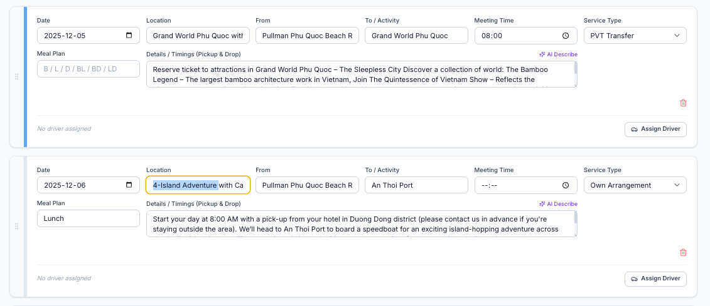

When Booking Creating extracting Mails Or Uploading Files 
Total Tour cost Need to Show (Missing) Some time its Missing 

Correctly extract Correct data and create agenda 

Some movements missing in agenda when agenda creating dont miss any Transfers or movement Do It correctly 
One day can be One Or more Transfers Read Correclt TQ and get correct idea and Create agenda Correctly 100% accurately 

SIC meeting time : 
Meeting Time Hide and Show Time range 
In time range not Show Start time and End Time Only Show Can join withing that time like 
Example SIC buss is Leaving : 8.30 U have to come there 8.00- 8.30 time period Like that 
if mention Show that time range if not Show Set 30 Mins Set auto 

Service Type: in agenda 
Need to Set Correct Service type always
if not mention clearly Fist One and Last One is Private Transfers in agenda 
Service Type Are : Private Transfers , SIC , OWN Arrenegement , Tickets Only ( if not clearly mention Always Private transfers)

IN Agenda Activity :
Activity name is not correcly Getting (now getting Location feild What need activity name feild needs Caption of the activity Need Correctly )

IN agenda Location :
Only need location name. Dont Need Other no Need Activity and service type (Transfer) in location feild 

When Agenda PDF generating :

Headers and Footers (Drive link and Folder name Time Dont need )
Passport num nationality remove 
Need to add : Package Excludes , Package Excludes.  , Exclusions , Tips , 

# Tour ref and IS_number is same 
# Sample Travel Confermations in have there : /Users/itaahaas/Desktop/Sasindu/Booking_System/Travel_Confermations 

