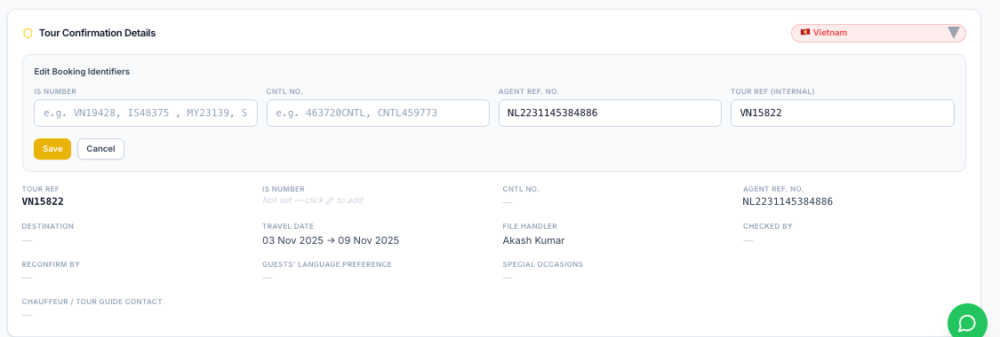
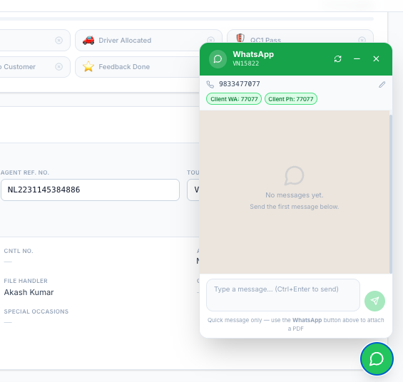

Client Confirm Part can do any user Visible button gor all users 

QC1 is  : Driver Allocation Done + Client Confirmation Done 
QC2 is  : Client Confirmation + Driver Allocation Done + Client Confirmation Done 

WHEN QC1 is DONE AUTOMATICALY SEND WHATSAPP MSG 1 AND MAIL NEED TO AUTO MATICALY SEND
QC2 is DONE AUTOMATICALY SEND WHATSAPP MSG 2 AND MAIL WITH DETAILS NEED TO AUTO MATICALY SEND
(UNDERSTAND WHATSAPP 2 MSGES AND NEED TO SET MAILS 2 ALSO )

ALWAYS SET TOUR REF TO IS NUMBER FEILD 
IS NUMBER ALWAYS BE LIKE (IS/VN/MY/SG)
IS78785 IS73423 VN47828 VN87239 SG54432 MY45664 SET TO IS_NUMBER AUTO 

IN THIS WHATSAPP COMPONENT I NEED TO CHAT
LIKE REAL CHAT REALTIME WHN CLIENT SENT MSG INEED TO VIEW FROM HERE AND I ALOS CAN SEND MSG FROM HERE LIKE IMPRO THAT WHATSAPP COMPONENT ALSO 

FIX ALLTHE ISSUESHAVING IN THIS SYSTEM 

