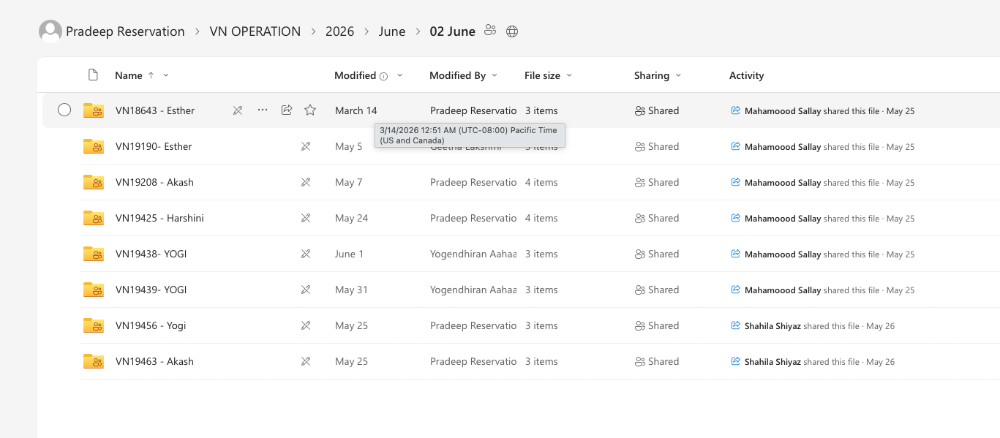
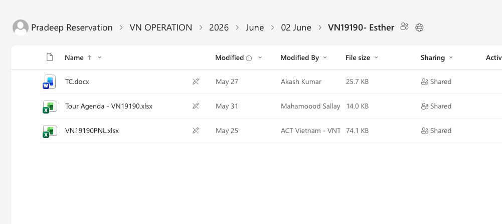

I created system allredy Mailbox --> Live processing prt (study the system )
http://localhost:3000/dashboard/admin/mail-inbox
email Reading Create bookingas and Addning pnls doing here 

I need to create new component when Files Creating and changing Create booking update booking featire Create  this need to be work on back end reall time 
i need frontend page to view what happen in this task in back end can accces tru utra_admin 

i need to create new Component Without Effecting that system need
Booking teams work in 4 separate OneDrives:
Sri Lanka.   : https://aahaas.sharepoint.com/:f:/r/sites/BookingExperienceB2B2/Shared%20Documents/SL%20Share%20Drive_?csf=1&web=1&e=LN9bhs
Vietnam.     : https://aahaas-my.sharepoint.com/:f:/r/personal/pradeep_reservation_aahaas_com/Documents/VN%20OPERATION?csf=1&web=1&e=ePKcVV
Singapore    : Pending
Malaysia.    : pending

Folder structure:sample 
vietnam Folder 

OneDrive
│
├── 2026
│   │
│   ├── January
│   │   │
│   │   ├── IS12345 - John Family
│   │   │   ├── TQ.pdf
│   │   │   ├── PNL.pdf
│   │   │   ├── Hotel Voucher.pdf
│   │   │   ├── Ticket.pdf
│   │   │   └── Confirmation.pdf
│   │   │
│   │   └── IS12346 - David Tour
│   │
│   └── February
│
└── 2025

sample downloadded booking file here : /Users/itaahaas/Downloads/VN19018 - Haji
Main 2 files : 
tc is :TC.docx 
PNL is : VN19018 - PNL
(dont get agenda Files)

when file creating and updating need to create booking 
One folder per Bokking 
when available inside the Travelqutation process file can automaticaly create the booking 
WHEN PNLS COMeTO SYSTEM THEN NEED TO UPDATE PNL VALUES process pnl 

In Booking details page add Locate to Drive Link also 

Add more component to Booking details Link with All files 
inside Folder 

if need any Env ask from me 
