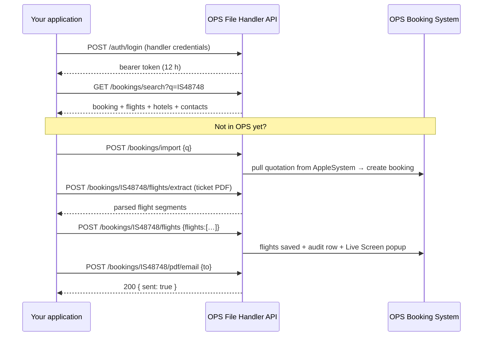

# File Handler API — Reference

**Version** 1.0 · **Base path** `/api/public/fh/v1` · **Content type** `application/json`

| Environment | Base URL |
|---|---|
| Local | `http://localhost:3000/api/public/fh/v1` |
| Live  | `https://ops.aahaas.com/api/public/fh/v1` |

---

## 1. What this API does

The File Handler Portal (`/filehandler`) is where an external file handler looks a
booking up, types in the flights and hotels they have arranged, fixes the agent
and guest contact details, raises a cancellation, and sends the guest a "Booking
Update" PDF.

This API is that same portal, without the browser. Everything a handler can click,
another application can call — with the same validation, the same
`file_handler_logs` audit rows, and the same effect on the OPS dashboards and the
office Live Screen.



### How a booking is identified

Everywhere `{ref}` appears in a path — and in `q` for search/import — send **any
one** of these:

| Value | Example | Matches in OPS |
|---|---|---|
| Booking ref | `IS48748` | `bookingRef` |
| IS number | `IS 48748` | `isNumber` (spaces are stripped, case ignored) |
| CNTL / quotation number | `479416CNTL` | `cntlNumber` |

Remember to URL-encode the segment if it contains a space.

### The response envelope

Every response — success or failure — has the same shape:

```jsonc
// success
{
  "success": true,
  "message": "Added 2 flights to IS48748",   // present when there is something to say
  "data":    { /* the payload */ },
  "request_id": "0f2c…",                     // quote this in a support ticket
  "timestamp": "2026-08-01T09:14:22.418Z"
}

// failure
{
  "success": false,
  "error": "flight_no is required",
  "code":  "FLIGHT_NO_REQUIRED",             // branch on this, never on the message
  "request_id": "0f2c…",
  "timestamp": "2026-08-01T09:14:22.418Z"
}
```

`request_id` is also returned as the `x-request-id` header, including on the
binary PDF download.

The only endpoint that does not return JSON is `GET /bookings/{ref}/pdf` without
`?format=base64` — that streams `application/pdf`.

---

## 2. Authentication

Two kinds of caller, one token format. All authenticated calls carry:

```
Authorization: Bearer <access_token>
```

### 2.1 A file handler's own login

The email (or phone) and password the handler already uses on the portal. Nothing
has to be configured on the server, and the handler keeps full portal
capabilities — the token is issued with scope `*`.

```http
POST /auth/login
Content-Type: application/json

{ "credential": "nimal@appleholidays.lk", "password": "…" }
```

```jsonc
{
  "success": true,
  "message": "Authenticated as Nimal Perera",
  "data": {
    "access_token": "eyJhbGciOiJIUzI1NiIsInR5cCI6IkpXVCJ9…",
    "token_type": "Bearer",
    "expires_in": 43200,
    "expires_at": "2026-08-01T21:14:22.418Z",
    "scopes": ["*"],
    "subject_type": "handler",
    "client_name": "Nimal Perera",
    "file_handler": { "id": "clx…", "name": "Nimal Perera", "email": "nimal@appleholidays.lk", "country": "SRILANKA" }
  }
}
```

The account must be **approved** (`isActive`). An unapproved one gets
`403 ACCOUNT_PENDING`. A handler deactivated *after* a token was issued is
rejected on the next call — approval is re-checked on every request, not just at
login.

### 2.2 A service client

A machine account configured in the server environment. Use this when the calling
application has its own users and should never hold handler passwords.

```http
POST /auth/login
{ "username": "fh_integration", "password": "…", "act_as": "nimal@appleholidays.lk" }
```

A service token must always resolve a file handler to act as — every write is
attributed to a real person in the audit trail. It is taken from, in order:

1. the `X-File-Handler` request header (handler **email or id**),
2. `act_as` given at login and baked into the token,
3. the server default `FH_PUBLIC_API_ACT_AS`.

If none resolves, the call fails with `400 ACT_AS_REQUIRED`. A client configured
with `"lockActAs": true` ignores the header and can only ever act as its
configured handler.

```http
GET /bookings/IS48748
Authorization: Bearer <service token>
X-File-Handler: nimal@appleholidays.lk
```

### 2.3 Static API key

When `FH_PUBLIC_API_KEY` is set, a caller that cannot hold a token may send it
instead of the `Authorization` header. `X-File-Handler` is still required (or the
server default).

```http
GET /bookings/IS48748
X-API-Key: <FH_PUBLIC_API_KEY>
X-File-Handler: nimal@appleholidays.lk
```

### 2.4 Scopes

Handler tokens get `*`. Service clients get whatever `FH_PUBLIC_API_CLIENTS`
grants them:

| Scope | Unlocks |
|---|---|
| `booking:read` | search, read a booking, list flights/hotels, verify, me, cancel status |
| `booking:write` | update contacts and important notes |
| `booking:import` | import from AppleSystem |
| `booking:cancel` | raise a cancellation request |
| `flight:write` | add / replace / remove flights |
| `hotel:write` | add / replace / remove hotels |
| `document:read` | download the Booking Update PDF |
| `document:send` | email the Booking Update PDF |
| `ai:extract` | GPT-4o flight extraction |
| `activity:read` | the audit trail feed |
| `*` | all of the above |

A call outside the token's scopes returns `403 INSUFFICIENT_SCOPE`.

### 2.5 Token lifetime and lockout

Tokens last 12 hours (`FH_PUBLIC_API_TOKEN_TTL_MIN`). An expired one returns
`401 TOKEN_EXPIRED` — log in again; there is no refresh endpoint by design.
Eight failed logins for the same credential lock it for five minutes
(`429 TOO_MANY_ATTEMPTS`).

---

## 3. Discovery

### `GET /` — what this API offers

No token required. Returns the name, version, auth summary, scope list and every
endpoint. Useful as a health check and as the single URL to hand a new integrator.

---

## 4. Accounts

### `POST /auth/register` — self-registration

No token required. Creates a **pending** file handler; an ultra/super admin must
approve it in `/dashboard/admin/file-handlers` before it can log in anywhere.

```jsonc
{
  "name": "Nimal Perera",
  "email": "nimal@appleholidays.lk",
  "password": "at-least-6-chars",
  "phone": "+94 77 123 4567",
  "whatsapp_phone": "+94 77 123 4567",
  "country": "SRILANKA"     // ALL | VIETNAM | SRILANKA | SINGAPORE_MALAYSIA | SINGAPORE | MALAYSIA
}
```

→ `201` `{ "id": "clx…", "pending_approval": true }`
· `409 ALREADY_REGISTERED` if the email is taken.

### `GET /auth/register?email=…` — availability check

No token required. `{ "exists": true, "approved": false }` — nothing else is
disclosed.

### `GET /auth/verify` — is my token still good?

```jsonc
{
  "valid": true,
  "subject_type": "handler",
  "client_name": "Nimal Perera",
  "scopes": ["*"],
  "authenticated_via": "bearer",
  "acting_as": { "id": "clx…", "name": "Nimal Perera", "email": "…", "country": "SRILANKA" }
}
```

### `GET /auth/me` — profile of the acting handler

Adds `stats.total_actions` and `stats.bookings_touched` to the profile, so the
calling app can show a handler their own footprint.

---

## 5. Bookings

### `GET /bookings/search?q=IS48748` — the portal search box

| Query | Default | Meaning |
|---|---|---|
| `q` | — | **required** — booking ref, IS number or CNTL number |
| `limit` | `10` | 1–50 |
| `auto_import` | `false` | when nothing matches locally, pull it from AppleSystem (also needs `booking:import`) |

```jsonc
{
  "query": "IS48748",
  "count": 1,
  "imported": false,
  "results": [ /* full booking objects — see §5.3 */ ]
}
```

An empty result is a `200` with `count: 0`, not a 404 — searching is not finding.

### `POST /bookings/import` — pull one in from AppleSystem

For when the booking exists as a confirmed AppleSystem quotation but was never
imported into OPS. Same pipeline as the portal's "import" rescue path: fetch the
quote template, map it, create the booking with the automation user as creator,
and stamp the acting file handler on it.

```jsonc
{ "q": "IS48748" }     // aliases: is_number, booking_ref, ref
```

→ `201` with the new booking, or `200` with `already_existed: true` if OPS had it
all along. Idempotent — safe to retry.

| Code | Status | When |
|---|---|---|
| `BOOKING_NOT_FOUND` | 404 | Not in OPS and not in AppleSystem |
| `APPLESYSTEM_UNREACHABLE` | 502 | AppleSystem did not answer |
| `COUNTRY_UNKNOWN` | 422 | The IS number does not map to an operating country |
| `MAPPING_FAILED` | 422 | The quotation could not be mapped to a booking |

### `GET /bookings/{ref}` — the whole booking

```jsonc
{
  "booking": {
    "booking_ref": "IS48748",
    "is_number": "IS48748",
    "cntl_number": "479416CNTL",
    "quotation_no": "479416CNTL",
    "status": "GT_VERIFIED",
    "version": 3,
    "agent": "Make My Trip",
    "agent_booking_id": "NH70123456",
    "file_handler": "Nimal Perera",
    "operation_country": "SRILANKA",
    "arrival_date": "2026-09-04",
    "departure_date": "2026-09-11",
    "pax": { "adults": 2, "children": 1, "infants": 0 },
    "quoted_total": 1840.0,
    "currency": "USD",
    "lead_passenger": "Rahul Sharma",
    "contacts": {
      "agent_email": "ops@mmt.com",   "agent_phone": "+91 …",  "agent_whatsapp": "+91 …",
      "contact_email": "rahul@…",     "contact_phone": "+91 …", "contact_whatsapp": "+91 …"
    },
    "important_notes": "Vegetarian meals throughout.",
    "passengers":     [ { "id": "…", "name": "Rahul Sharma", "type": "ADULT", "age": null, "is_lead": true, "nationality": "IN", "passport": "…" } ],
    "flights":        [ { "id": "…", "flight_no": "UL309", "date": "2026-09-04", "from_airport": "BOM", "dep_time": "01:25", "to_airport": "CMB", "arr_time": "03:05", "airline": "SriLankan", "notes": null } ],
    "accommodations": [ { "id": "…", "city": "Kandy", "hotel": "Earl's Regency", "check_in": "2026-09-06", "check_out": "2026-09-08", "nights": 2, "address": "…", "contact": "…", "room_type": "Deluxe Double", "meal_type": "HB" } ],
    "cancellation": {
      "requested_at": null, "previous_status": null, "cancelled_at": null,
      "requested_by": null, "requested_by_email": null, "reason": null,
      "fees": [], "fee_total": null, "pending_approval": false
    },
    "created_at": "2026-06-02T08:11:00.000Z",
    "updated_at": "2026-07-30T14:52:11.000Z"
  }
}
```

`404 BOOKING_NOT_FOUND` when nothing matches.

### `PATCH /bookings/{ref}` — contacts and notes

The only booking fields a file handler may edit. Send just the ones that changed;
send `""` or `null` to clear one. `PUT` behaves identically.

```jsonc
{
  "agent_email": "ops@mmt.com",
  "agent_phone": "+91 22 1234 5678",
  "agent_whatsapp": "+91 98765 43210",
  "contact_email": "rahul@example.com",
  "contact_phone": "+91 98111 22333",
  "contact_whatsapp": "+91 98111 22333",
  "important_notes": "Guest lands with a wheelchair request."
}
```

Contacts may also be nested under `"contacts": { … }`, and camelCase spellings
(`agentEmail`, `importantNotes`) are accepted — send whichever your app already
produces.

→ `200` `{ "booking": {…}, "changed_fields": ["agentEmail", "importantNotes"] }`
· `422 NOTHING_TO_UPDATE` when the body has no editable field.

Anything else — status, pax, dates, prices — is deliberately not editable here;
those belong to the booking team and to the AppleSystem quotation API.

---

## 6. Flights

### `GET /bookings/{ref}/flights`

`{ "booking_ref": "IS48748", "count": 2, "flights": [ … ] }`, earliest first.

### `POST /bookings/{ref}/flights` — add

One flight:

```jsonc
{
  "flight_no": "UL309",
  "date": "2026-09-04",
  "from_airport": "BOM",
  "dep_time": "01:25",
  "to_airport": "CMB",
  "arr_time": "03:05",
  "airline": "SriLankan Airlines",
  "notes": "Guest requested aisle seats"
}
```

Or a whole itinerary at once:

```jsonc
{ "flights": [ { … }, { … } ] }
```

The batch is validated **in full before anything is written**, so one bad segment
rejects the request rather than leaving half an itinerary in the booking.

**Required:** `flight_no`, `date`, `from_airport`, `to_airport`.
**Optional:** `dep_time`, `arr_time`, `airline`, `notes`.
camelCase (`flightNo`, `fromApt`, `depTime`, …) is accepted, which is why the
output of `/flights/extract` can be posted back verbatim.

→ `201` `{ "added": 2, "flights": [ … ], "booking": { … } }`

| Code | Status |
|---|---|
| `FLIGHT_NO_REQUIRED` / `FLIGHT_DATE_REQUIRED` / `FROM_AIRPORT_REQUIRED` / `TO_AIRPORT_REQUIRED` | 422 |
| `INVALID_DATE` | 422 |
| `NO_FLIGHTS` | 422 |

### `PUT /bookings/{ref}/flights/{flightId}` — replace

Same body and same required fields as `POST`: this is a full replace, not a
partial patch. `PATCH` is accepted as an alias with identical semantics.
`404 FLIGHT_NOT_FOUND` if that flight is not on that booking.

### `DELETE /bookings/{ref}/flights/{flightId}` — remove

→ `200` `{ "deleted": true, "flight": { … } }`

### `POST /bookings/{ref}/flights/extract` — read a ticket with GPT-4o

Three input modes:

```jsonc
// 1 — pasted e-ticket text
{ "text": "UL309 04SEP BOM CMB 0125 0305 …" }

// 2 — base64 image or PDF (a data: URL is tolerated too)
{ "file_base64": "JVBERi0xLjQK…", "file_name": "ticket.pdf" }
```

```http
# 3 — multipart, the same upload the portal sends
POST /bookings/IS48748/flights/extract
Content-Type: multipart/form-data
file=@ticket.pdf
```

By default **nothing is written** — the parsed segments come back for a human to
confirm:

```jsonc
{
  "source": "ticket.pdf",
  "count": 2,
  "saved": false,
  "flights": [ { "flightNo": "UL309", "date": "2026-09-04", "fromApt": "BOM", "depTime": "01:25", "toApt": "CMB", "arrTime": "03:05", "airline": "SriLankan" } ]
}
```

Add `?save=true` (or `"save": true` in the JSON body / `save` in the form) to
extract and persist in a single call — the response is then `201` with `saved:
true` and the saved rows.

Limits: JPG, PNG, WebP, GIF or PDF, up to 10 MB (`UNSUPPORTED_FILE`,
`FILE_TOO_LARGE`, `EMPTY_FILE`). Extraction costs an OpenAI call and is logged to
`AiUsageLog` like every other AI call in the system.

---

## 7. Accommodations

### `GET /bookings/{ref}/accommodations`

`{ "booking_ref": "IS48748", "count": 3, "accommodations": [ … ] }`, earliest
check-in first.

### `POST /bookings/{ref}/accommodations` — add

```jsonc
{
  "city": "Kandy",
  "hotel": "Earl's Regency",
  "check_in": "2026-09-06",
  "check_out": "2026-09-08",
  "room_type": "Deluxe Double",
  "meal_type": "HB",
  "address": "Tennekumbura, Kandy 20000",
  "contact": "+94 81 242 2122"
}
```

Batch with `{ "accommodations": [ … ] }` (or `"hotels"`).

**Required:** `city`, `hotel`, `check_in`, `check_out`.
`nights` is computed from the dates unless you send it explicitly.
camelCase (`checkIn`, `roomType`, `mealType`) accepted.

→ `201` `{ "added": 1, "accommodations": [ … ], "booking": { … } }`

### `PUT /bookings/{ref}/accommodations/{accId}` — replace
### `DELETE /bookings/{ref}/accommodations/{accId}` — remove

Same conventions as flights; `404 HOTEL_NOT_FOUND` when the hotel is not on that
booking.

---

## 8. Cancellation

> **This does not cancel the booking.** A file handler may only *request* a
> cancellation; the accounts team approves it. That is exactly what the portal
> button does, and the API keeps the same rule.

### `GET /bookings/{ref}/cancel` — may I?

```jsonc
{
  "booking_ref": "IS48748",
  "status": "GT_VERIFIED",
  "pending_approval": false,
  "cancellable": true,
  "cancellation": { "requested_at": null, "reason": null, "fees": [], "fee_total": null, "pending_approval": false }
}
```

Use it to enable or grey out a Cancel button before the user presses it.

### `POST /bookings/{ref}/cancel` — raise the request

```jsonc
{
  "reason": "Guest cancelled the trip",
  "fees": [
    { "note": "Hotel one-night penalty", "amount": 120 },
    { "note": "Non-refundable entrance tickets", "amount": 30 }
  ]
}
```

`fees` is optional. Its total is **always recomputed server-side** and never
trusted from the caller.

What happens:

1. the booking moves to `PENDING_CANCELLATION`, its previous status is remembered,
2. the acting handler is recorded as the requester (`… (File Handler)`),
3. a `CANCEL_REQUESTED` audit row fires the Live Screen alert,
4. every active `AC_USER` is emailed a link to `/dashboard/accounts/cancellations`.

→ `202 Accepted`

```jsonc
{
  "booking": { /* now PENDING_CANCELLATION */ },
  "status": "PENDING_CANCELLATION",
  "pending_approval": true,
  "cancellation_fee_total": 150,
  "email_sent": true
}
```

A mail failure does **not** undo the request — it comes back as
`email_sent: false` with a different message. Treat the request as recorded and
tell the ops team to check.

| Code | Status | When |
|---|---|---|
| `REASON_REQUIRED` | 422 | `reason` missing or blank |
| `ALREADY_PENDING_CANCELLATION` | 409 | A request is already awaiting approval |
| `NOT_CANCELLABLE` | 409 | The booking's status is past the point of cancelling |

`DELETE` on the same path is accepted as an alias for apps that model this as a
delete.

---

## 9. The Booking Update PDF

### `GET /bookings/{ref}/pdf` — download

Streams `application/pdf` with
`Content-Disposition: attachment; filename="IS48748_479416CNTL_Updates.PDF"`.

For integrations that cannot handle a binary body, `?format=base64` returns it
inside the normal envelope instead:

```jsonc
{ "filename": "IS48748_479416CNTL_Updates.PDF", "content_type": "application/pdf", "size_bytes": 148213, "content_base64": "JVBERi0…" }
```

### `POST /bookings/{ref}/pdf/email` — send it

```jsonc
{
  "to": "rahul@example.com",
  "subject": "Your updated Sri Lanka itinerary",
  "message": "Flights are now confirmed — see the attached update.",
  "self": false
}
```

Omit `to` (or send `"self": true`) and it goes to the acting handler's own
address — the portal's "Save & Confirm" behaviour.

→ `200` `{ "sent": true, "to": "…", "filename": "…", "subject": "…" }`
· `422 RECIPIENT_INVALID` · `502 EMAIL_FAILED` (Microsoft Graph refused it)

Both endpoints write an audit row (`PDF_GENERATED` / `PDF_EMAILED`).

---

## 10. Activity feed

### `GET /activity`

The File Handler audit trail, newest first — the same feed behind the office Live
Screen.

| Query | Default | Meaning |
|---|---|---|
| `scope` | `me` | `me` = the acting handler only, `all` = every handler |
| `booking_ref` | — | Restrict to one booking (ref, IS or CNTL) |
| `action` | — | Filter by action; repeatable or comma-separated |
| `since` | — | ISO date — only entries after it |
| `limit` | `50` | 1–200 |

```jsonc
{
  "scope": "me",
  "count": 2,
  "events": [
    { "id": "…", "action": "FLIGHT_ADDED", "file_handler": "Nimal Perera", "booking_ref": "IS48748",
      "is_number": "IS48748", "cntl_number": "479416CNTL", "operation_country": "SRILANKA",
      "details": "Added flight UL309 (BOM→CMB) [API]", "created_at": "2026-08-01T09:14:22.418Z" }
  ]
}
```

Actions: `LOGIN`, `AS_IMPORTED`, `DETAILS_UPDATED`, `FLIGHT_ADDED`,
`FLIGHT_UPDATED`, `HOTEL_UPDATED`, `CANCEL_REQUESTED`, `PDF_GENERATED`,
`PDF_EMAILED`.

Every write made through this API is tagged `[API]` in `details` (and
`[API · <client name>]` for service clients), so ops staff can always tell an
integration's change from a portal click.

---

## 11. Error codes

| Code | Status | Meaning |
|---|---|---|
| `CREDENTIALS_REQUIRED` | 422 | Login body incomplete |
| `INVALID_CREDENTIALS` | 401 | Wrong username/password |
| `ACCOUNT_PENDING` | 403 | The handler exists but is not approved |
| `TOO_MANY_ATTEMPTS` | 429 | 8 failed logins — locked for 5 minutes |
| `UNAUTHORIZED` | 401 | No bearer token sent |
| `INVALID_TOKEN` | 401 | Signature/issuer/audience did not verify |
| `TOKEN_EXPIRED` | 401 | Past `expires_at` — log in again |
| `INSUFFICIENT_SCOPE` | 403 | The token lacks the scope this endpoint needs |
| `ACT_AS_REQUIRED` | 400 | Service caller did not name a file handler |
| `HANDLER_NOT_FOUND` | 404 | `X-File-Handler` matches no handler |
| `HANDLER_INACTIVE` | 403 | That handler is not approved for portal access |
| `NOT_CONFIGURED` | 503 | No signing secret configured on the server |
| `QUERY_REQUIRED` | 422 | `q` missing on search/import |
| `BOOKING_NOT_FOUND` | 404 | No booking matches `{ref}` |
| `NOTHING_TO_UPDATE` | 422 | PATCH body had no editable field |
| `FLIGHT_NOT_FOUND` / `HOTEL_NOT_FOUND` | 404 | Not on that booking |
| `FLIGHT_NO_REQUIRED`, `FLIGHT_DATE_REQUIRED`, `FROM_AIRPORT_REQUIRED`, `TO_AIRPORT_REQUIRED`, `NO_FLIGHTS` | 422 | Flight validation |
| `HOTEL_REQUIRED`, `CITY_REQUIRED`, `CHECK_IN_REQUIRED`, `CHECK_OUT_REQUIRED`, `NO_HOTELS` | 422 | Hotel validation |
| `INVALID_DATE` | 422 | Unparseable date (use `YYYY-MM-DD`) |
| `REASON_REQUIRED` | 422 | Cancellation without a reason |
| `ALREADY_PENDING_CANCELLATION` | 409 | Already awaiting accounts approval |
| `NOT_CANCELLABLE` | 409 | Status no longer allows cancellation |
| `INPUT_REQUIRED`, `FILE_REQUIRED`, `UNSUPPORTED_FILE`, `EMPTY_FILE` | 422 | Extraction input |
| `FILE_TOO_LARGE` | 413 | Over 10 MB |
| `RECIPIENT_INVALID` | 422 | Bad or missing email recipient |
| `PDF_FAILED` | 502 | PDF renderer failed |
| `EMAIL_FAILED` | 502 | Microsoft Graph refused the send |
| `APPLESYSTEM_UNREACHABLE`, `IMPORT_FAILED` | 502 | AppleSystem import problems |
| `MAPPING_FAILED`, `COUNTRY_UNKNOWN` | 422 | Quotation could not be mapped |
| `ALREADY_REGISTERED` | 409 | Registration email already used |
| `INVALID_JSON`, `INVALID_BODY` | 400 | The body is not a JSON object |
| `INTERNAL_ERROR` | 500 | Logged server-side against `request_id` |

---

## 12. Typical flows

### Handle a booking end to end

```
POST /auth/login                         → token
GET  /bookings/search?q=IS48748&auto_import=true
POST /bookings/IS48748/flights/extract   (ticket PDF)   → segments
POST /bookings/IS48748/flights           { "flights": [ …segments… ] }
POST /bookings/IS48748/accommodations    { "hotels": [ … ] }
PATCH /bookings/IS48748                  { "contact_phone": "…" }
POST /bookings/IS48748/pdf/email         { "to": "guest@…" }
```

### Nightly reconciliation from another system

```
POST /auth/login                          (service client)
GET  /activity?scope=all&since=2026-07-31T00:00:00Z&limit=200
GET  /bookings/{ref}                      for anything that changed
```

### Guest cancels

```
GET  /bookings/IS48748/cancel             → { "cancellable": true }
POST /bookings/IS48748/cancel             { "reason": "…", "fees": [ … ] }   → 202
… accounts approve in OPS; poll GET /bookings/IS48748 for status CANCELLED
```

---

## 13. Rules worth repeating

- **Idempotency.** `POST /bookings/import` is safe to retry. Adding a flight or a
  hotel is not — it creates a new row each time. Read first, or track the ids you
  get back.
- **No country restriction.** File handlers may work on bookings in every
  operating country; that is a deliberate product decision, mirrored here.
- **Ownership stamping.** The first handler to touch a booking through this API is
  written into `booking.fileHandler` if it was empty. Existing values are never
  overwritten.
- **Everything is audited.** There is no silent write; each one lands in
  `file_handler_logs` and surfaces on the office Live Screen.
- **Money and status are out of reach.** Nothing here can change a booking's
  status (except requesting cancellation), its prices, or its P&L.

---

## 14. Changelog

| Version | Date | Change |
|---|---|---|
| 1.0 | 2026-08-01 | First release — auth, search/import, bookings, flights (+AI extraction), accommodations, cancellation requests, PDF download/email, activity feed |
