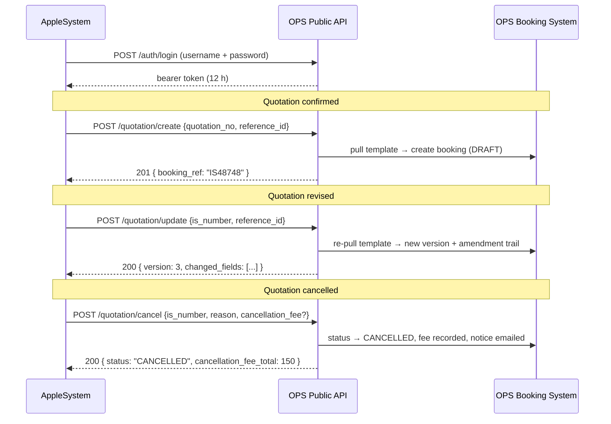

# AppleSystem → OPS Quotation API — Reference

**Version** 1.0 · **Base path** `/api/public/as/v1` · **Content type** `application/json`

| Environment | Base URL |
|---|---|
| Local | `http://localhost:3000/api/public/as/v1` |
| Live  | `https://ops.aahaas.com/api/public/as/v1` |

---

## 1. What this API does

AppleSystem is where a quotation is born, revised and cancelled. OPS is where the
tour is actually operated. This API is the wire between them: one call from AS and
the matching OPS booking is created, amended, or **cancelled automatically** — no
one in ops has to touch anything.



### How a booking is identified

Send **any one** of these — the API resolves them in this order:

| Field | Meaning | Matches in OPS |
|---|---|---|
| `is_number` | The IS number, e.g. `IS48748` | `bookingRef` / `isNumber` (case- and space-insensitive) |
| `booking_ref` | Same thing, if AS calls it that | `bookingRef` |
| `quotation_no` | The AS quotation reference number, e.g. `479416CNTL` | `cntlNumber` (most recent match) |
| `reference_id` | The AS list-row id — **only** needed when the API has to pull the template from AppleSystem | — |

`camelCase` spellings (`isNumber`, `quotationNo`, `referenceId`) and the aliases
`ref_number` / `quotation_ref` are accepted everywhere too.

---

## 2. Authentication

### 2.1 `POST /auth/login`

Exchange the integration credentials for a bearer token.

**Request**

```json
{ "username": "as_integration", "password": "AppleSystem@2026#Quote" }
```

**Response `200`**

```json
{
  "success": true,
  "message": "Authenticated as AppleSystem Integration (sample)",
  "data": {
    "access_token": "eyJhbGciOiJIUzI1NiIsInR5cCI6IkpXVCJ9...",
    "token_type": "Bearer",
    "expires_in": 43200,
    "expires_at": "2026-08-01T20:00:19.122Z",
    "scopes": ["*"],
    "client_name": "AppleSystem Integration (sample)"
  },
  "request_id": "12aceb9f-cda0-4820-9e86-8530d866c78c",
  "timestamp": "2026-08-01T08:00:19.129Z"
}
```

Send it on every other call:

```
Authorization: Bearer <access_token>
```

Tokens last **12 hours** (`AS_PUBLIC_API_TOKEN_TTL_MIN`). Cache the token on the AS
side and re-login on a `401` with code `UNAUTHORIZED` — do not log in per request.

**Failures**

| Status | Code | When |
|---|---|---|
| `401` | `INVALID_CREDENTIALS` | Wrong username or password |
| `422` | `CREDENTIALS_REQUIRED` | `username` / `password` missing |
| `429` | `TOO_MANY_ATTEMPTS` | 8 failed logins — locked 5 minutes |
| `503` | `NOT_CONFIGURED` | No API client configured on the server |

### 2.2 `GET /auth/verify`

Cheap "is my token still good?" probe — worth calling before a batch run.

```json
{
  "success": true,
  "message": "Token is valid",
  "data": {
    "valid": true,
    "client": "as_integration",
    "client_name": "AppleSystem Integration (sample)",
    "scopes": ["*"],
    "authenticated_via": "bearer"
  }
}
```

### 2.3 Static API key (alternative)

If the AS side cannot hold a token, set `AS_PUBLIC_API_KEY` on the server and send
`x-api-key: <key>` instead of the bearer header. It grants full scope, so treat it
like a password. The bearer flow is preferred.

---

## 3. Create — `POST /quotation/create`

Pulls the quotation from AppleSystem and creates the OPS booking as a `DRAFT`
(passengers, hotels, itinerary and emergency contacts included).

**Request**

```json
{
  "quotation_no": "479416CNTL",
  "reference_id": "18452",
  "is_number": "IS48748"
}
```

| Field | Required | Notes |
|---|---|---|
| `quotation_no` | ✅ | AS quotation reference |
| `reference_id` | ✅ | AS list-row id — the template cannot be fetched without it |
| `is_number` | optional | Fallback used only when the template itself carries no IS number |

**Response `201`**

```json
{
  "success": true,
  "message": "Booking IS48748 created from quotation 479416CNTL.",
  "data": {
    "action": "CREATE",
    "already_exists": false,
    "booking": {
      "booking_ref": "IS48748",
      "is_number": "IS48748",
      "quotation_no": "479416CNTL",
      "status": "DRAFT",
      "version": 1,
      "agent": "Pick your trail",
      "file_handler": "Sajid Joshua",
      "arrival_date": "2026-08-07",
      "departure_date": "2026-08-13",
      "pax": { "adults": 2, "children": 0, "infants": 0 },
      "quoted_total": 460,
      "currency": "USD",
      "operation_country": "SRILANKA",
      "cancelled_at": null,
      "cancellation_reason": null,
      "cancellation_fee_total": null,
      "updated_at": "2026-08-01T07:16:39.884Z"
    }
  }
}
```

**Idempotent.** Calling it again for the same IS number returns `200` with
`already_exists: true` and changes nothing — safe to retry after a timeout.

---

## 4. Update — `POST /quotation/update`

Also accepts `PUT` and `PATCH`. Two ways to use it:

### 4.1 Re-pull path (recommended)

Send `reference_id` alongside the identifier and the revised template is pulled
fresh from AppleSystem — AS stays the source of truth.

```json
{
  "is_number": "IS48748",
  "quotation_no": "479416CNTL",
  "reference_id": "18452",
  "amendment_note": "Revision 3 — hotel changed in Kandy",
  "force_replace_details": false
}
```

What happens:

- Header fields (dates, pax, price, currency, agent, file handler, inclusions,
  T&Cs, cancellation deadline) are always refreshed.
- Passengers / hotels / itinerary are **replaced** only while the booking is still
  early (`DRAFT`, `BT_CONFIRMED`, `GT_REVIEW`, `CHANGE_REQUESTED`, `GT_VERIFIED`).
  Past that, a revision must not silently wipe operational detail on a live tour —
  set `"force_replace_details": true` to overwrite anyway. The response says which
  happened via `details_replaced`.
- The booking `version` increments and a `BookingVersion` snapshot + `StatusEvent`
  record the amendment.

### 4.2 Patch path

No `reference_id`? Then only the `fields` you send are applied — good for a small
correction.

```json
{
  "quotation_no": "479416CNTL",
  "amendment_note": "Pax corrected by agent",
  "fields": {
    "pax_adults": 3,
    "pax_children": 1,
    "quoted_total": 690.0,
    "currency": "USD",
    "arrival_date": "2026-08-08",
    "departure_date": "2026-08-14"
  }
}
```

Accepted `fields` keys: `arrival_date`, `departure_date`, `pax_adults`,
`pax_children`, `pax_infants`, `quoted_total`, `currency`, `agent`,
`file_handler`, `contact_email`, `contact_phone`, `package_includes`,
`package_excludes`, `important_notes`, `quotation_no`.

**Response `200`**

```json
{
  "success": true,
  "message": "Booking IS48748 updated to version 3.",
  "data": {
    "action": "UPDATE",
    "booking": { "...": "same shape as create" },
    "changed_fields": ["header", "dates", "pax", "pricing", "passengers", "accommodations", "itinerary"],
    "details_replaced": true,
    "version": 3
  }
}
```

**Extras**

| Field | Default | Effect |
|---|---|---|
| `create_if_missing` | `false` | Import the quotation instead of failing with `BOOKING_NOT_FOUND` (needs `quotation_no` + `reference_id`) |
| `force_replace_details` | `false` | Replace child records even on an advanced booking |
| `amendment_note` | auto | Text stored on the amendment trail |

A booking that is already `CANCELLED` (`409 BOOKING_CANCELLED`) or `COMPLETED`
(`409 BOOKING_COMPLETED`) cannot be updated.

---

## 5. Cancel — `POST /quotation/cancel`

Also accepts `DELETE`. **This is the automatic cancellation.** The booking goes
straight to `CANCELLED` — it does *not* wait in `PENDING_CANCELLATION` for accounts
approval, because the commercial decision was already made in AppleSystem. The
accounts trail is still filled in (marked auto-approved) so cancellation reports
read exactly like a manual cancellation.

**Request — minimal**

```json
{ "is_number": "IS48748", "reason": "Guest cancelled the trip" }
```

**Request — with an optional cancellation fee**

```json
{
  "quotation_no": "479416CNTL",
  "reason": "Guest cancelled — inside the hotel penalty window",
  "cancellation_fee": 150.00,
  "currency": "USD",
  "cancelled_by": "Nimal Perera",
  "cancelled_by_email": "nimal@appleholidays.lk",
  "suppress_email": false
}
```

**Request — itemised fees** (use instead of `cancellation_fee`; the total is always
computed server-side, never trusted from the caller)

```json
{
  "is_number": "IS48748",
  "reason": "Guest cancelled",
  "cancellation_fees": [
    { "note": "Hotel one-night penalty", "amount": 120 },
    { "note": "Non-refundable entrance tickets", "amount": 30 }
  ]
}
```

| Field | Required | Notes |
|---|---|---|
| `is_number` / `quotation_no` / `booking_ref` | ✅ (any one) | How the booking is found |
| `reason` | optional | Defaults to *"Quotation cancelled in AppleSystem"* |
| `cancellation_fee` | optional | Single amount, ≥ 0 |
| `cancellation_fees` | optional | `[{ note, amount }]` — wins over `cancellation_fee` |
| `currency` | optional | Overrides the booking currency for the fee |
| `cancelled_by`, `cancelled_by_email` | optional | Who cancelled it on the AS side |
| `suppress_email` | optional | `true` skips the cancellation notice email |

**Response `200`**

```json
{
  "success": true,
  "message": "Booking IS48748 has been cancelled automatically. Cancellation fee USD 150.00 recorded.",
  "data": {
    "action": "CANCEL",
    "already_cancelled": false,
    "previous_status": "GT_VERIFIED",
    "booking": {
      "booking_ref": "IS48748",
      "status": "CANCELLED",
      "cancelled_at": "2026-08-01T08:14:02.117Z",
      "cancellation_reason": "Guest cancelled — inside the hotel penalty window",
      "cancellation_fee_total": 150,
      "...": "…"
    },
    "cancellation_fee_total": 150,
    "cancellation_fees": [{ "note": "Cancellation fee (AppleSystem)", "amount": 150 }],
    "email_sent": true
  }
}
```

### What OPS does on cancel

1. `status → CANCELLED`, with the pre-cancellation status kept as `cancelPrevStatus`.
2. `cancelledAt`, `cancellationReason`, `cancelledByName/Email` stamped.
3. Fee lines + computed `cancellationFeeTotal` saved on the booking, so the
   accounts cancellation report picks it up unchanged.
4. Auto-approval trail written (`cancelDecidedByName: "AppleSystem (automatic)"`).
5. A `StatusEvent` audit row is appended.
6. The cancellation notice email goes to the standard notify list — unless
   `suppress_email: true`. **A mail failure never rolls back the cancellation**; it
   comes back as `email_sent: false`.

### Idempotency & guards

- Already cancelled → `200` with `already_cancelled: true`, nothing changes. Retry
  freely.
- `COMPLETED` / `AMENDED` bookings → `409 NOT_CANCELLABLE`.
- Unknown identifier → `404 BOOKING_NOT_FOUND`.

---

## 6. Status — `GET /quotation/status`

Read-only. Useful before firing a write, or to confirm one landed.

```
GET /quotation/status?is_number=IS48748
GET /quotation/status?quotation_no=479416CNTL
```

```json
{
  "success": true,
  "message": "Booking IS48748 is in GT_VERIFIED",
  "data": {
    "found": true,
    "is_cancelled": false,
    "booking": {
      "booking_ref": "IS48748",
      "is_number": "IS48748",
      "quotation_no": "479416CNTL",
      "status": "GT_VERIFIED",
      "version": 2,
      "agent": "Pick your trail",
      "file_handler": "Sajid Joshua",
      "arrival_date": "2026-08-07",
      "departure_date": "2026-08-13",
      "pax": { "adults": 2, "children": 0, "infants": 0 },
      "quoted_total": 460,
      "currency": "USD",
      "operation_country": "SRILANKA",
      "cancelled_at": null,
      "cancellation_reason": null,
      "cancellation_fee_total": null,
      "updated_at": "2026-08-01T07:16:39.884Z"
    }
  }
}
```

---

## 7. Sync — `POST /quotation/sync` (one URL for everything)

If AS would rather configure a **single** webhook URL, point it here and put the
event in the body. Behaviour is identical to the dedicated endpoints.

```json
{
  "action": "CANCEL",
  "is_number": "IS48748",
  "reason": "Guest cancelled",
  "cancellation_fee": 150
}
```

`action` accepts `CREATE` / `UPDATE` / `CANCEL` plus the natural aliases AS emits:
`CREATED`, `NEW`, `UPDATED`, `AMENDED`, `REVISED`, `CANCELLED`, `CANCELLATION`.

---

## 8. Response envelope & error codes

Every response — success or failure — has the same shape:

```jsonc
// success
{ "success": true, "message": "…", "data": { … }, "request_id": "uuid", "timestamp": "ISO-8601" }

// failure
{ "success": false, "error": "…", "code": "MACHINE_CODE", "request_id": "uuid", "timestamp": "ISO-8601" }
```

`request_id` is also returned as the `x-request-id` header — quote it when
reporting a problem; it appears in the server logs.

| Status | Code | Meaning | What AS should do |
|---|---|---|---|
| 400 | `INVALID_JSON` / `INVALID_BODY` | Body is not a JSON object | Fix the payload |
| 401 | `UNAUTHORIZED` | Missing / invalid / expired token | Re-login, retry once |
| 401 | `INVALID_CREDENTIALS` | Bad username or password | Stop, alert |
| 403 | `UNAUTHORIZED` (scope) | Client not allowed this action | Stop, alert |
| 404 | `BOOKING_NOT_FOUND` | No booking for that IS / quotation number | Create it, or ignore |
| 409 | `BOOKING_CANCELLED` / `BOOKING_COMPLETED` | Too late to update | Ignore |
| 409 | `NOT_CANCELLABLE` | Booking status forbids cancellation | Escalate to ops |
| 409 | `IDENTIFIER_MISMATCH` | Quotation belongs to a different IS number | Fix the identifier |
| 409 | `COUNTRY_MISMATCH` | Revision moves the booking to another country | Escalate to ops |
| 422 | `IDENTIFIER_REQUIRED` | No identifier sent | Fix the payload |
| 422 | `INVALID_FIELD` / `INVALID_FEE` | A field failed validation | Fix the payload |
| 422 | `NOTHING_TO_UPDATE` | Update call carried no changes | Skip |
| 422 | `QUOTATION_NOT_MAPPABLE` | Quotation has no IS number or no dated itinerary | Fix in AS, retry |
| 422 | `COUNTRY_UNRESOLVED` | IS number prefix is not `IS` / `VN` / `SG` / `MY` | Fix in AS |
| 429 | `TOO_MANY_ATTEMPTS` | Login lockout (8 failures / 5 min) | Back off |
| 502 | `UPSTREAM_UNAVAILABLE` | AppleSystem template API is down or slow | Retry with backoff |
| 503 | `NOT_CONFIGURED` | Server has no API client configured | Alert ops |
| 500 | `INTERNAL_ERROR` | Unexpected — logged with the `request_id` | Retry once, then alert |

**Retry guidance:** `502`, `503` and `500` are safe to retry with exponential
backoff — create and cancel are both idempotent. Do not retry `4xx` other than
`401` (once, after re-login) and `429` (after the stated wait).

---

## 9. Security notes

- Credentials are configuration, not database users — no schema change, and the
  integration client can never sign into the OPS web UI.
- Tokens are HS256 JWTs signed with `AS_PUBLIC_API_JWT_SECRET` (falls back to
  `NEXTAUTH_SECRET`), scoped `iss=ops.aahaas/as-public-api`, `aud=applesystem`.
- Per-action scopes: `quotation:create`, `quotation:update`, `quotation:cancel`,
  `quotation:read`. A client configured with `["quotation:read"]` can look bookings
  up but never cancel one.
- Password comparison is constant-time; 8 failed logins lock a username for 5
  minutes on that server instance.
- Every create / update / cancel writes an `ActivityLog` row (`AS_API_CREATE`,
  `AS_API_UPDATE`, `AS_API_CANCEL`) naming the calling client, plus a `StatusEvent`
  on the booking.
- Always call over HTTPS in production. The sample credentials are refused in
  production unless explicitly re-enabled.
