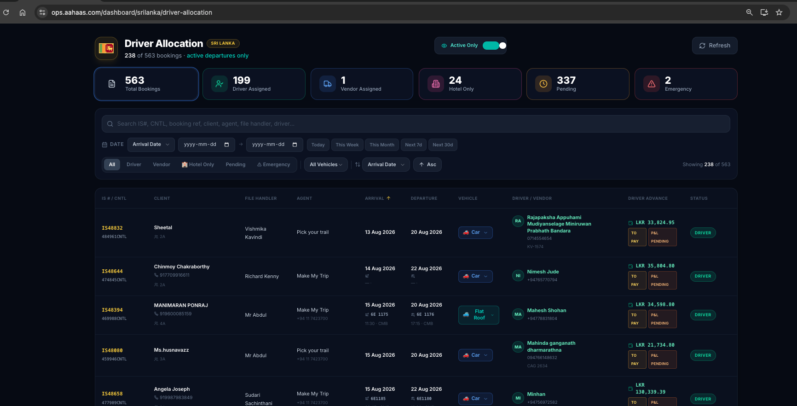
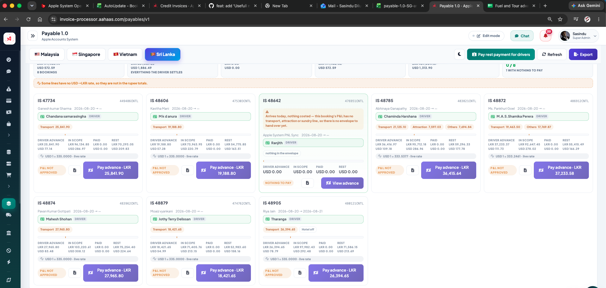

I need to create new component - this is only for srilankan bokings 
in side the OPS system(Booking system )

in there need to show 
List of like table like view creativly show this 

1. ISnumber (main) - cntl number (sub)
2. Arrivale date 
3. Driver name (Assined driver) - when click on the driver need to show full detailed about driver and the vehicle with account details 
4. Perticular booking invoice amount (Get from Accounts syetem)
5. Total Trasport cost (balance payable + Driver advance)
6. Driver Advance (Calculated by accounts system, Now it have in iside the sl drive allocate ops system   )
7. balance payable (Driver advance Rest Payment - Accounts system )
8. Actual Paid balance - thats Identify Acounts team rest payament done  
9. Transport Profit/loss - (Total Trasport cost - (Paid Driver advance + Actival paid balance)

Do this component more creatively and more think and more Functional 
need good filtering option (Travel date by Defult travel date after 2 days )

Can download PDF ,Excel file.....
do this correcly 

accounts system and booking system both ahaving same db there fore can data read direct db.

Dont Change or edit live db Dont loss live data 