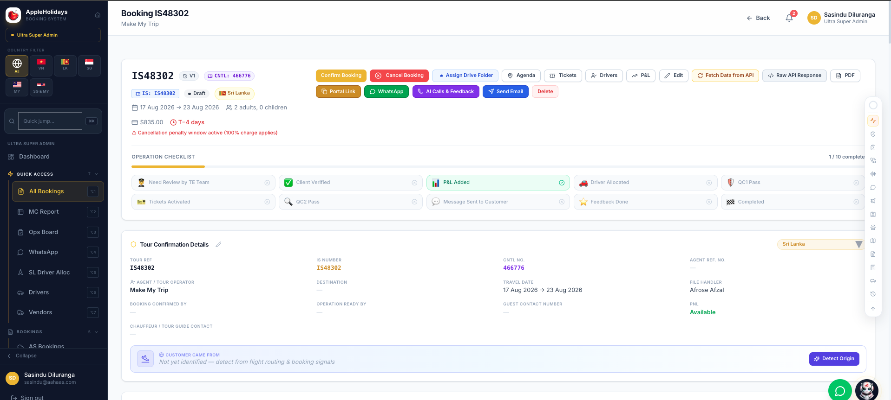
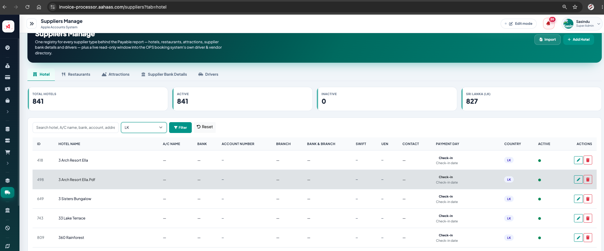

Need create new component for Booking system 
Inside Booking details page And the Sepearte for all bookings (Add navbar - Prechqe )can serch wth is number seteleted booking 

Create Componenet Name as Pre-checking 

That Perticlular Bookings Having :
Hotels need to be Check Availablity before 10 days that prticuar trip start 
there is 2 ways to check 1 one is 

In that component show need hotels that perticular booking 
Try to match that hotels with that hotel table (Inside the Accounts system both systems using same db  )

If ont match can add hotel for that name Can edit hotel detils Add option to Using Open ai and serch that hotel and get Hotel details with contacts and an save IF have Hotel Whatsapp number to Creating new feild If have whatsapp Number auto maticaly set that if not can add manualy 

 D-10 Hotel Reconfirmation 
The system should automatically identify bookings that are 10 days before the hotel check-in date (D-10) and add them to the Hotel Reconfirmation Queue.

Information to Display

For each hotel reservation, show:

Field	Details
Booking Reference	Tour / booking reference
Hotel Confirmation Status	Confirmed / Pending / Issue
Hotel Name	Confirmed hotel name
Hotel Contact Number	Hotel phone number
Room Type	Double / Twin / Triple / etc.
Room Count	Number of rooms booked
Room Category	Superior / Deluxe / Suite / etc.
Check-in Date	Guest check-in date
Check-out Date	Guest check-out date
Night Count	Total number of nights
Meal Type	BB / HB / FB / RO etc.
Adult Count	Number of adults
Child Count	Number of children
CWB	Child With Bed
CNB	Child No Bed

Hotel Confirmation Number	Confirmation/reference received from hotel
Hotel Reconfirmation Status	Pending / Confirmed / Discrepancy
Last Checked	Date and time of latest check

3. Hotel Contact Information
The system should maintain the hotel's contact details.

Where possible, the hotel telephone number can be retrieved or suggested using Google hotel/business information.

However, the system should also allow staff to:

Add a hotel number manually.

Update an incorrect number.

Save verified contact information for future bookings.

Maintain multiple numbers where necessary.

#when ding this task dont loss any live data ensure all live databasees data is safe dont loss any live data 