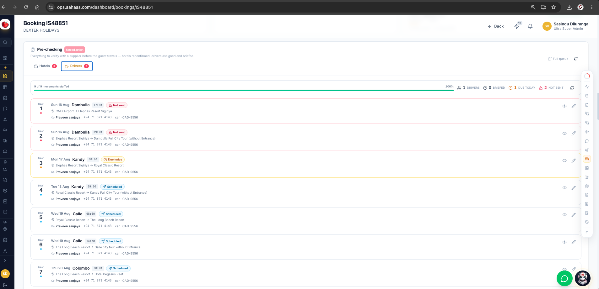

# Automated Hotel Re-Checking – Auto Call Module

## 1. Objective

Develop an **Automated Hotel Re-Checking Call System** to contact hotels and reconfirm all important reservation details before the guest's arrival.

The system must perform hotel re-checking at two stages:

* **D-10** — 10 days before the hotel check-in date
* **D-1** — 1 day before the hotel check-in date

The purpose is to identify any reservation issues before the guest arrives and ensure that the hotel has the correct booking information.

---

## 2. Re-Checking Schedule

```text
Hotel Booking Confirmed
        │
        ▼
   Monitor Check-in Date
        │
        ├──────────────► D-10 Re-Check
        │                 │
        │                 ▼
        │           Automated Hotel Call
        │                 │
        │                 ▼
        │          Save Call Results
        │
        ▼
   Continue Monitoring
        │
        ▼
     D-1 Re-Check
        │
        ▼
 Automated Hotel Call
        │
        ▼
 Final Confirmation
        │
        ▼
 Guest Check-in
```

---

# 3. Details to Check with the Hotel

During both the **D-10** and **D-1** calls, the automated calling system must verify the following information with the hotel.

### A. Reservation Confirmation

* [ ] Is the reservation confirmed?
* [ ] Hotel confirmation number
* [ ] Booking/reference number
* [ ] Guest name
* [ ] Lead guest name
* [ ] Check-in date
* [ ] Check-out date
* [ ] Number of nights

### B. Room Details

* [ ] Room type
* [ ] Room category
* [ ] Number of rooms
* [ ] Bed type (Double / Twin / Triple, etc.)
* [ ] Extra bed, if applicable
* [ ] Child With Bed (CWB), if applicable
* [ ] Child No Bed (CNB), if applicable

### C. Guest / Pax Details

* [ ] Number of adults
* [ ] Number of children
* [ ] Number of infants
* [ ] Total number of guests

### D. Meal Plan

* [ ] Confirm the booked meal plan
* [ ] Breakfast included
* [ ] Half Board, if applicable
* [ ] Full Board, if applicable
* [ ] Any other meal arrangements

### E. Special Requests

* [ ] Early check-in request
* [ ] Late check-out request
* [ ] Honeymoon arrangement
* [ ] Birthday / anniversary arrangement
* [ ] Connecting rooms
* [ ] Adjacent rooms
* [ ] Extra bed
* [ ] Baby cot
* [ ] Accessibility requirements
* [ ] Any other special requests mentioned in the booking

### F. Payment Status

* [ ] Has the hotel received the payment?
* [ ] Is the booking fully paid?
* [ ] Is there any outstanding payment?
* [ ] Is a payment required before check-in?
* [ ] Is the hotel expecting the guest to make any payment directly?

### G. Voucher Verification

* [ ] Has the hotel received the booking voucher?
* [ ] Does the voucher match the hotel's reservation?
* [ ] Are there any differences between the voucher and the hotel's system?

### H. Final Hotel Confirmation

At the end of the call, the system should ask the hotel to confirm:

> **"Can you confirm that this reservation is fully confirmed and that there will be no issue when the guest arrives for check-in?"**

---

# 4. D-10 Re-Checking Process

```text
Check-in Date - 10 Days
        │
        ▼
Retrieve Booking Details
        │
        ▼
Retrieve Hotel Contact Number
        │
        ▼
Start Automated AI Call
        │
        ▼
Verify Reservation Details
        │
        ├── Everything Correct ──► Mark "D-10 Confirmed"
        │
        └── Issue Found ─────────► Mark "Action Required"
                                      │
                                      ▼
                              Notify Reservation Team
```

The **D-10 check** is the first complete verification of the booking. It provides enough time for the reservation team to correct room, payment, voucher, guest, or other booking issues.

---

# 5. D-1 Final Re-Checking Process

```text
Check-in Date - 1 Day
        │
        ▼
Check Previous D-10 Result
        │
        ▼
Start Final Automated Call
        │
        ▼
Reconfirm Critical Details
        │
        ├── Confirmed ─────► D-1 Final Confirmed
        │
        └── Issue Found ───► URGENT ACTION REQUIRED
                                   │
                                   ▼
                          Notify Reservation Team
                                   │
                                   ▼
                           Resolve Before Arrival
```

The **D-1 check** is the final verification before the guest arrives. Any problem identified at this stage should be treated as **urgent**.

---

# 6. Overall Auto-Call Flow

```text
                     HOTEL BOOKING
                          │
                          ▼
                 Booking Confirmed
                          │
                          ▼
                Monitor Check-in Date
                          │
              ┌───────────┴───────────┐
              │                       │
            D-10                     D-1
              │                       │
              ▼                       ▼
        Auto AI Call            Auto AI Call
              │                       │
              ▼                       ▼
       Verify Full Booking      Final Re-Check
              │                       │
        ┌─────┴─────┐           ┌─────┴─────┐
        │           │           │           │
     Correct      Issue      Confirmed     Issue
        │           │           │           │
        ▼           ▼           ▼           ▼
   D-10 Confirmed  Action    D-1 Final    URGENT
                   Required   Confirmed    Action
        │           │           │           │
        └───────────┴───────────┴───────────┘
                          │
                          ▼
                  Save Call History
                          │
                          ▼
                 Reservation Record
```

## 7. Information to Save After Every Call

The system should save:

* Call date and time
* Re-check type: **D-10 / D-1**
* Hotel name
* Hotel contact number
* Booking reference
* Call status
* Call duration
* Hotel representative's name, if available
* Reservation confirmation status
* Hotel confirmation number
* Verified booking details
* Issues identified
* Required actions
* Call transcript
* AI-generated call summary
* Call recording reference, if recording is enabled
* Final result: **Confirmed / Issue Found / No Answer / Call Failed / Follow-up Required**


==============================================================================================================================================================================================================================================================================================================================================================================================================================================================================================================================================================================================================================================================================


# Driver, Guide & Tour Vendor Explanation Call Structure


## 1. Purpose

This component manages **explanation and confirmation calls** for allocated **Drivers, Guides, and Tour Vendors**.

The system must ensure that the assigned person/vendor clearly understands the required itinerary or service before the travel date.

---

## 2. Driver Explanation Calls

### Call 1 — Initial Itinerary Confirmation

**When:** After the driver is allocated to the booking.

**Purpose:**

* Explain the assigned itinerary.
* Provide a clear summary of the trip or assigned movement.
* Confirm that the driver understands the requirements.
* Get confirmation that the driver is **OK with the itinerary**.
* Record any questions, issues, or requested changes.

**Final Status:**

* Confirmed
* Issue Reported
* Update Required
* No Answer / Call Failed

---

### Call 2 — Day-Before Reminder

**When:** **D-1 — one day before the travel/service date.**

**Purpose:**

* Remind the driver about the upcoming service.
* Explain the **full tour agenda / assigned movement again**.
* Reconfirm important details such as:

  * Date
  * Pickup time
  * Pickup location
  * Drop-off location
  * Guest details
  * Vehicle/service requirements
  * Important itinerary notes
* Ask whether there are any new issues or updates.
* Record all updates mentioned by the driver.
* Alert the Operations Team if any action is required.

---

## 3. Country-Based Driver Explanation

### Sri Lanka

For **Sri Lanka bookings**, the allocated driver may handle the complete tour.

Therefore, the call should explain the **full trip itinerary**, including:

**Booking → Arrival → Day-wise Tour Plan → Hotels/Transfers → Activities → Departure**

The driver must confirm that the **entire itinerary is understood and accepted**.

### Other Countries

For other countries, the driver may only be assigned to a **specific transfer or movement**.

Therefore, explain only the driver's assigned service.

**Example:**

**Booking → Airport Transfer → Assigned Driver**

Only explain:
**Airport → Hotel | Pickup Time | Guest | Vehicle | Special Notes**

Do not explain unrelated parts of the complete itinerary.

---

## 4. Guide Explanation Calls

The same confirmation process should apply to an **Allocated Guide**.

The system should identify the guide's assigned days/services and explain only the relevant itinerary.

**Call 1:** Explain assignment and get confirmation.

**Call 2 (D-1):** Remind the guide, explain the agenda again, and collect any updates/issues.

For a **full-tour guide**, explain the complete tour.
For a **specific-day/activity guide**, explain only the assigned section.

---

## 5. Tour Vendor Explanation Calls

The same process should apply to **Tour Vendors**.

The system should identify exactly what service the vendor is responsible for, such as:

**Booking → Tour/Activity → Assigned Vendor**

The call should confirm:

* Service/activity
* Date
* Reporting/pickup time
* Guest/PAX details
* Pickup and drop-off details
* Service requirements
* Special requests
* Vendor confirmation

A **D-1 reminder call** should reconfirm the service and capture any last-minute updates.

---

## 6. Issue & Update Handling

During either call, if the Driver, Guide, or Tour Vendor reports an issue:

**Call → Detect Issue → Save Note → Mark "Action Required" → Alert Operations Team**

Examples:

* Driver unavailable
* Wrong pickup time
* Wrong itinerary
* Vehicle issue
* Guide unavailable
* Vendor cannot provide the service
* Guest/service information mismatch
* Timing conflict
* Other requested changes

The issue and call notes must remain visible against the relevant booking and allocation.

---

## 7. Overall Flow

```text
Booking
   │
   ├── Allocated Driver
   │      ├── Call 1: Explain + Confirm
   │      └── D-1 Call: Reminder + Reconfirm
   │
   ├── Allocated Guide
   │      ├── Call 1: Explain + Confirm
   │      └── D-1 Call: Reminder + Reconfirm
   │
   └── Allocated Tour Vendor
          ├── Call 1: Explain + Confirm
          └── D-1 Call: Reminder + Reconfirm
                     │
                     ▼
               Any Issue?
                /      \
              No        Yes
              │          │
          Confirmed   Save Note
                         │
                         ▼
                  Alert Operations
```

### Key Rule

**Sri Lanka Driver → Explain the full trip itinerary when the driver handles the complete tour.**

**Other Country Driver → Explain only the particular assigned transfer/movement.**

**Guide / Tour Vendor → Explain only the itinerary and services allocated to them, unless they are responsible for the complete tour.**
