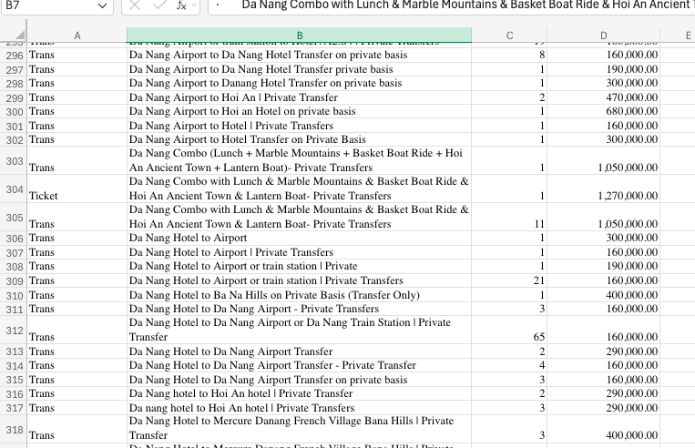
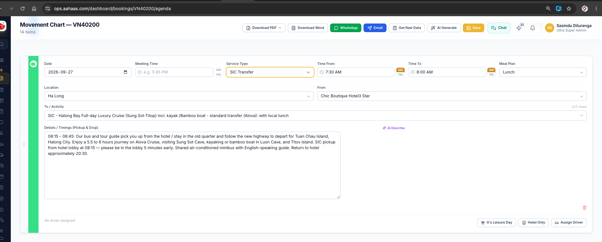
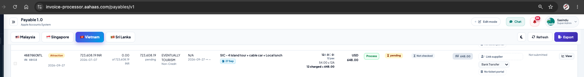

in the Booking system (OPS)i have to do some Changes inside the Agenda 

Inside settings can change the link of products use this sheet for now 
Here is NEW Product_sheet :
https://aahaas-my.sharepoint.com/:x:/p/sasindu/IQCCa-VX-VYrQYbQchimCXRyAZvAWVj9FIODmvQAZ6zOc0g?e=KVhaHd

IN the agenda page of  vietnam bookings
if there service Type is SIC Tranfer Or Privet Tour

In thet Agenda iteam shows Select Includes Seletion option 

1.Add there smale component in that can serch and Select includes That having | That Products having In the NEW product sheet ....
If the product is not there Can manualy add the product that should need to update in onether tab in the excell sheet 

Do this Creativly and more accurately and more thinking and advancely do this ....

In the Accounts system 

In the payable 
that perticular Line Includes pyable Like 

Need to show that Payable seperated That Agenda seleted as in the ops system beacous that things to pay separately...

for separated payable 

If the agenda Added seaparateded inclutions....

Do this thing more creatively and more accurate 

DOnt harm to any live data dont need to change any thing in the live data .....

