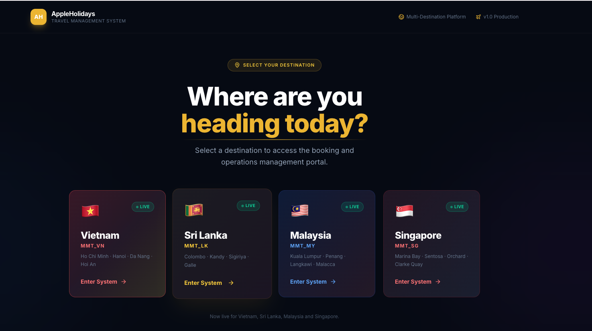

Get full idea and do this task Eficeiently and no errors 

In here 

I need : Vietnam ,  Srilanka , Singapoor & Malasia , All Countries 

Inside All counties has One User : Ultra Super Admin 
Can Do any task Of that system and can Permision for all -component access
Only who has can manage users need Critical services password to Log that

In vieatnam : has 4 Users  : Booking team ,  , travel experince team , Vietnam Admin
In Sri lanka has 3 Users :  Booking team , Ground & travel experince team , Sri Lanka Admin 
In Singapoor & Malasia has 3 Users :  Booking team , Ground & travel experince team , Admin 

When Mails Come to the mail box(Only split the Travel qutations mail Dont split PNL mails )
Check Subject Or Body or every where Mention the Country like Vietnam or Sri Lanka or Malaysia & Singapore mails Show Inside the perticular Country Opprations 

When Creating Automaticaly Booking 
Show Only Booking into perticular country operations 
there for When Creating Booking Check Inside the subject or mail tred Include the country (ietnam or Sri Lanka or Malaysia or Singapore) If specificly i dentyfy the country Inside the booking deatils save country perticular Booking if not identify country  , all country rocces team can view that and can Set country (Dropdown editable ietnam or Sri Lanka or Malaysia or Singapore )

ISNumber 
Srilanka Is NUmber Example : IS 48377( Staring from is )
Vietnam Is NUmber Example : VN19689 (Starting from VN )
Singapoor Is NUmber :  staring from SG ( SG22232 )  , 
Malaysia Is NUmber Example : Staring from MY  (MY23122)

this is only examples 
Identify Countries Mails Subject :(like this can change)
Sri Lanka Mail Subject Structure :
Sri Lanka package required

VN Mail Subject Structure : (like this can change)
NL2203895942674//VN19766 | Acme Booking on MakeMyTrip.com
Quotation | 402011365182 | Major Samir Raj - Vietnam - 030626 | 08/Jul/2026 - 14/Jul/2026 | 2 Adults | VN
Quotation | 402011412316 | Yash Basantwani - Vietnam - 090626

Malaysia Mail Subject Structure : (like this can change)
Malaysia Query--3 pax
HT - INQ2027124045 // 22nd Jun // Urgent

singapore Mail Subject Structure : (like this can change)
singapore package Ms Shivani

