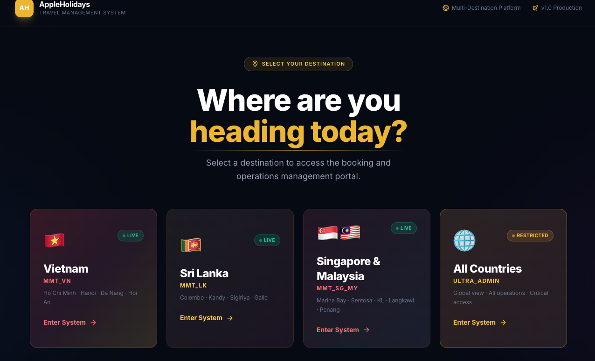
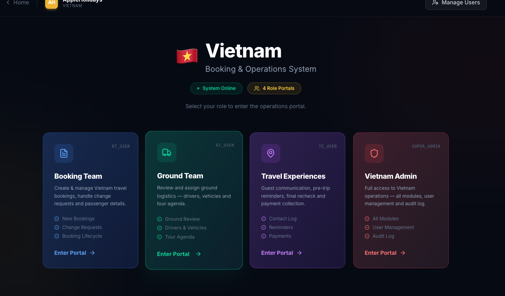
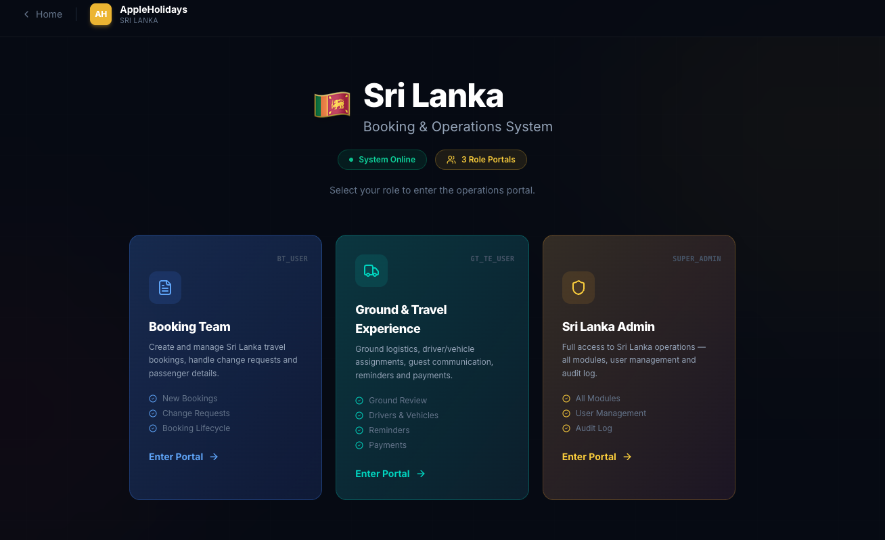
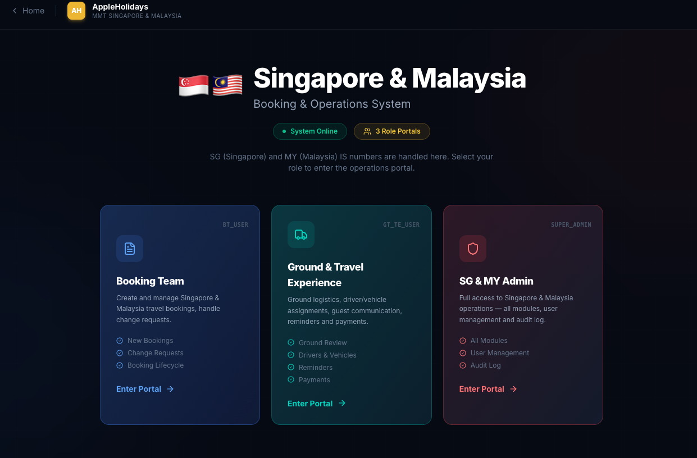

Get full idea and do this task Eficeiently and no errors 

Ultra Super Admin is correclt working 
i ned to Fix others 

When User go toths system User can see interface
First user see this Need to seclect country Process section here 

When Use select One country The use can see 
teams
VN : 
Sri lanka : 
SG MY : 

In vieatnam : has 4 Users  : Booking team , Ground team , travel experince team , Vietnam Admin : : Only can access vieatnam Booking Data Process 
In Sri lanka has 3 Users :  Booking team , Ground & travel experince team , Sri Lanka Admin 
In Singapoor & Malasia has 3 Users :  Booking team , Ground & travel experince team , Admin 

VN_Booking team , VN_travel experince team , VN_Ground team , Vietnam Admin : Only can access vieatnam Booking Data Process 
SL_Booking team , SL_Ground & travel experince team , SL_ Sri Lanka Admin : Only can access Sri lanka  Booking Data Process 
SG_MY_Booking Team , SG_MY_Ground & travel experince team , SG_MY_Admin : Only can access Sigapoor and malasia  Booking Data Process 

filter and show Only Perticular country data 
When User Adding Need to select user add fr wht country what possition 
By Utra_super admin 

